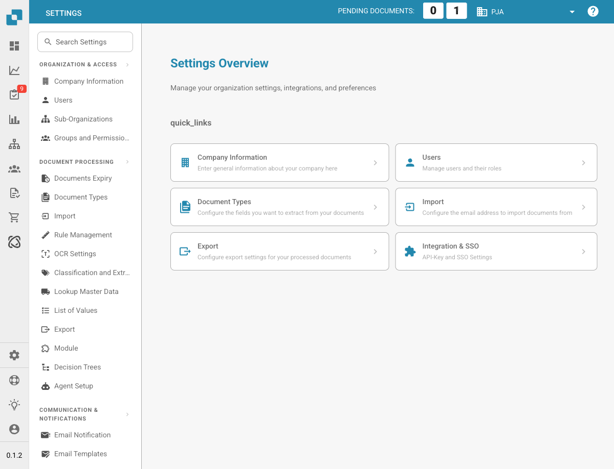

# Settings

<figure><figcaption>
Settings Overview Page
</figcaption></figure>

The Settings area is your central hub for configuring DocBits. It is organized into five main sections:

## 1. Organization & Access

Manage your company profile and control who can access what.

* **Company Information**: Enter your company name, address, tax ID, and other legal identifiers.
* **Users**: Add, edit, or deactivate user accounts and assign roles (Admin, System Admin).
* **Sub-Organizations**: Create and manage sub-organizations for multi-entity setups.
* **Groups and Permissions**: Define user groups and configure granular permissions for each group.

## 2. Document Processing

Configure how documents are imported, processed, and exported.

* **Documents Expiry**: Set automatic deletion rules for documents (e.g., delete after 48 hours, 1 week, etc.).
* **Document Types**: Define and configure the document types DocBits processes (Invoices, Orders, Delivery Notes, etc.), including fields, table columns, scripts, and more.
* **Import**: Set up how documents enter DocBits — via email (IMAP/Office 365), FTP, or file upload. Configure file types and page limits.
* **Rule Management**: Define conflict resolution rules for invoice-to-PO reconciliation, including tolerance settings and approval workflows.
* **OCR Settings**: Configure Optical Character Recognition quality thresholds, E-Text usage, AI OCR version, and table extraction behavior.
* **Classification and Extraction**: Set up document splitting, amount formatting, table extraction methods, classification rules, and AI models.
* **Lookup Master Data**: Configure how extracted data is validated against master data from your ERP system (e.g., supplier accounts, purchase orders).
* **List of Values**: Create and manage predefined value lists used in dropdowns and data validation.
* **Export**: Configure how and where processed documents are sent — via Webhook, SFTP, SMB, or Infor integrations (IDM, ION, M3, LN).
* **Module**: Enable or disable optional features such as PO Dashboard, Auto Accounting, Supplier Portal, Workflow Builder, QR-Code Extraction, and more.
* **Decision Trees**: Build rule-based decision logic using a visual designer. Supports multiple policies (Unique, First, Priority, Collect, etc.).
* **Agent Setup**: Create and manage automation agents and communication channels for automated document processing workflows.

## 3. Communication & Notifications

Control how DocBits communicates with users and processes incoming emails.

* **Email Notification**: Configure email alerts for document processing events and status changes.
* **Email Templates**: Create and manage reusable email templates for notifications, organized by document type.
* **Email Ingestion**: Configure how incoming emails are automatically classified and converted into documents. Includes rules for classification, field extraction, processing, sender management, and training — organized by document type (Orders, Invoices, Quotes, Delivery Notes, COA, PO Confirm).

## 4. System & Administration

Monitor system health, manage integrations, and maintain security.

* **Integration & SSO**: Configure API keys for external integrations and set up Single Sign-On (SSO) with identity providers.
* **Watchdog**: Set up the Watchdog service for automated document import from local directories.
* **Dashboard**: Customize dashboard behavior — filters, export settings, action permissions, and status display options.
* **Activity Logging**: View real-time system event logs filtered by severity (Debug, Info, Warning, Error), time range, and service.
* **Analytics**: Access detailed analytics dashboards including Logs Analytics, Auth Security monitoring, and API Metrics with Real User Monitoring (RUM).
* **Access Audit**: Enable and review audit trails that track all Create, Update, and Delete actions across your organization for compliance and security.
* **System Licenses**: View and manage API license information and usage.
* **Cache Management**: Configure automatic cache clearing intervals (TTL) for Received Delivery, Purchase Order, and Task/Notification caches.
* **Fulltext Search Settings**: Configure full-text search capabilities across your documents and data (requires the Fulltext Search module to be enabled).

## 5. Supplier Settings

Configure the Supplier Portal and manage supplier-related workflows.

* **Supplier General Settings**: Set up supplier portal invitation fields, configure workflow statuses (Not Invited, Open, Pending Registration, Approved, Rejected), and manage approval settings.
* **Email Templates**: Create and manage email templates specifically for supplier communications.
* **Supplier Layout**: Customize the layout and appearance of the Supplier Portal.
* **Export Configuration**: Configure how supplier data is exported to external systems.
* **Supplier Group**: Create and manage supplier groups to categorize and organize your suppliers.
* **User and Supplier Group Mapping**: Link internal users to specific supplier groups to control visibility and access.
