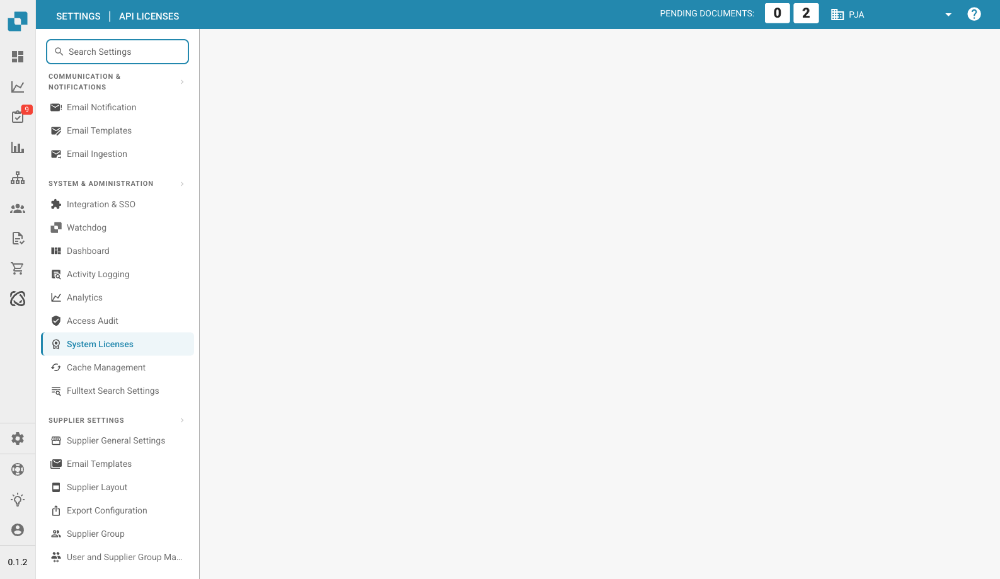

# System Licenses

<figure><figcaption>
System Licenses Page
</figcaption></figure>

The System Licenses page (also called API Licenses) displays all third-party software packages used by DocBits, including their version numbers and associated open-source licenses. This information is provided for compliance and transparency purposes.
