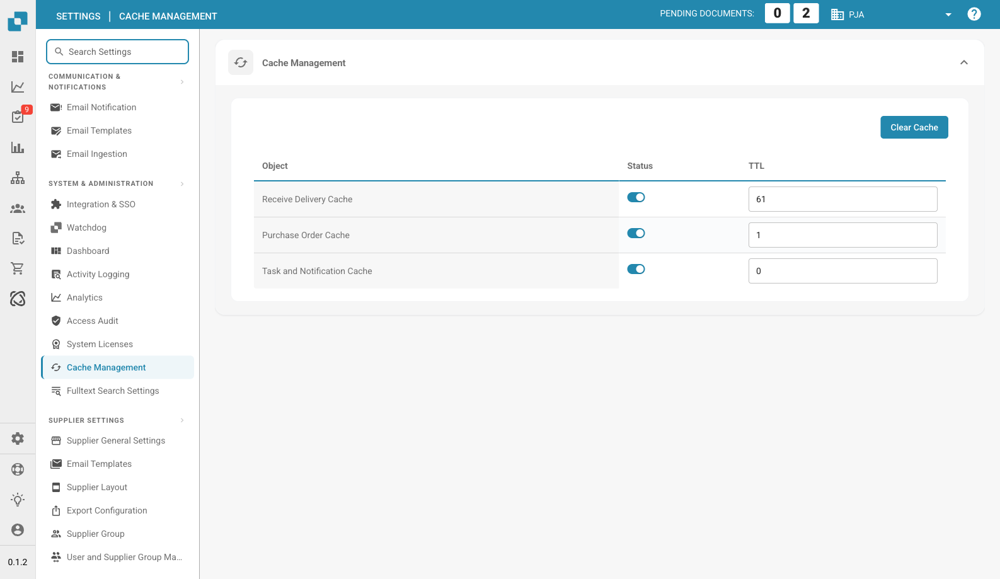

# Cache Management

<figure><figcaption>
Cache Management Page
</figcaption></figure>

Cache Management controls automatic cache clearing for frequently accessed data. Enabling caching improves performance by reducing repeated API calls.

## Clear Cache

Click the **Clear Cache** button (top-right) to manually invalidate all cached data immediately.

## Cache Table

| Column | Description |
|--------|-------------|
| **Object** | The type of cached data (e.g., Receive Delivery Cache, Purchase Order Cache). |
| **Status** | Toggle to enable or disable caching for this object. |
| **TTL** | Time to Live in minutes — how long cached data remains valid before being automatically refreshed. Set to `0` to disable automatic expiry. |

## Available Caches

| Cache | Description |
|-------|-------------|
| **Receive Delivery Cache** | Caches delivery receipt data used during PO matching. |
| **Purchase Order Cache** | Caches purchase order data for faster lookup during document processing. |
| **Task and Notification Cache** | Caches task counts and notification data shown in the dashboard. |
