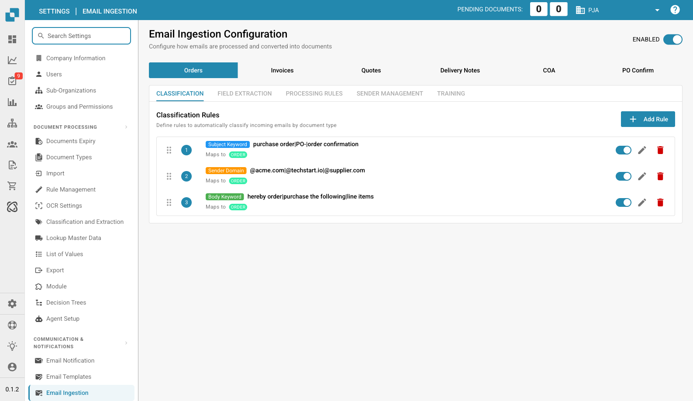

# Email Ingestion

<figure><figcaption>
Email Ingestion Configuration Page
</figcaption></figure>

Email Ingestion configures how DocBits processes incoming emails and converts them into documents. You can define classification rules, extraction settings, and processing logic per document type.

## Enabling Email Ingestion

Use the **ENABLED** toggle in the top-right to activate or deactivate email ingestion globally.

## Document Type Tabs

The top row shows tabs for each supported document type:

* **Orders** — Purchase orders received via email
* **Invoices** — Invoice documents
* **Quotes** — Quote/offer documents
* **Delivery Notes** — Delivery note documents
* **COA** — Certificate of Analysis documents
* **PO Confirm** — Purchase order confirmations

Select a tab to configure settings specific to that document type.

## Configuration Tabs

Each document type has five configuration tabs:

### Classification

Define rules to automatically classify incoming emails by document type. Each rule has:

| Field | Description |
|-------|-------------|
| **Rule Type** | How to match: Subject Keyword, Sender Domain, or Body Keyword. |
| **Pattern** | The keyword or domain pattern to match (pipe `|` separated for multiple values). |
| **Maps to** | The document type this rule classifies to (e.g., ORDER, INVOICE). |

Rules are evaluated in order (drag to reorder). Each rule can be toggled active/inactive, edited, or deleted.

### Field Extraction

Configure which fields to extract from the email body and how to map them to document fields.

### Processing Rules

Define rules for how matched emails are processed (e.g., auto-approve, route to specific workflow).

### Sender Management

Manage known senders and their default document type mappings.

### Training

Train the classification model with sample emails to improve automatic classification accuracy.
