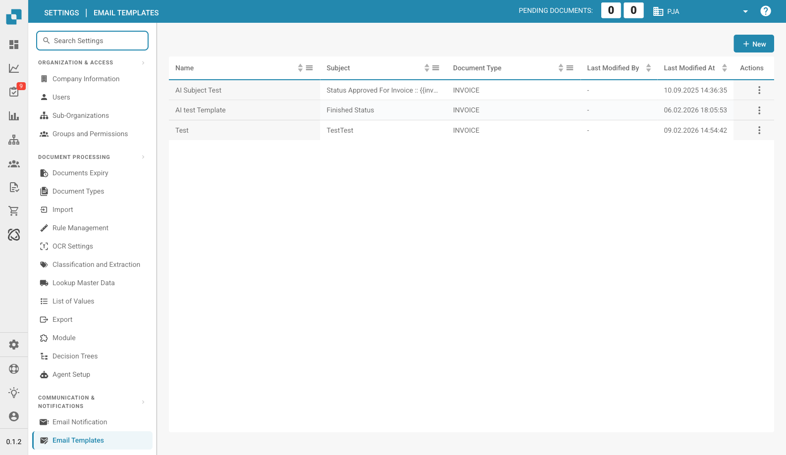

# Email Templates

<figure><figcaption>
Email Templates Page
</figcaption></figure>

Email Templates let you design reusable email layouts used by Email Notifications. Templates define the subject line and body content, including dynamic placeholders for document data.

## Template List

| Column | Description |
|--------|-------------|
| **Name** | A descriptive name for the template. |
| **Subject** | The email subject line. Supports placeholders like `{{invoice_id}}`. |
| **Document Type** | Which document type this template applies to (e.g., INVOICE). |
| **Last Modified By** | The user who last edited this template. |
| **Last Modified At** | Timestamp of the last change. |
| **Actions** | Three-dot menu to edit or delete. |

## Creating a Template

1. Click **+ New** in the top-right corner.
2. Enter a **Name** and **Subject** (use `{{field_name}}` for dynamic values).
3. Select the **Document Type**.
4. Design the email body using the built-in editor.
5. Click **Save**.

## Dynamic Placeholders

Use double curly braces to insert document field values into your template:

* `{{invoice_id}}` — The invoice number
* `{{supplier_name}}` — The supplier name
* `{{total_amount}}` — The total amount
* `{{status}}` — The current document status
