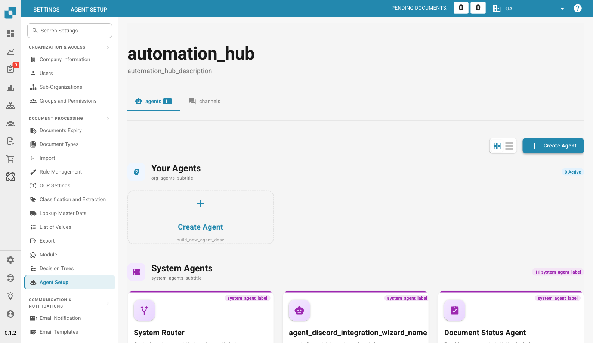

# Agent Setup

<figure><figcaption>
Agent Setup Page (Automation Hub)
</figcaption></figure>

The Agent Setup page (Automation Hub) lets you manage AI-powered agents that automate tasks within DocBits. It is divided into two tabs: **Agents** and **Channels**.

## Agents Tab

### Your Agents

Custom agents you create for your organization. Click **+ Create Agent** to build a new one.

### System Agents

Pre-built agents provided by DocBits. Each can be toggled **Active** or **Inactive**:

| Agent | Description |
|-------|-------------|
| **System Router** | Routes chat messages to the appropriate specialized agent. Always active with highest priority. |
| **Document Status Agent** | Provides document statistics including counts, validation status, and processing overview. |
| **Email Setup Wizard** | Multi-step wizard for configuring email imports (Gmail, Outlook, Yahoo). |
| **FTP Setup Agent** | Handles FTP import configuration, troubleshooting, and monitoring. |
| **Invoice Validator** | Validates invoice fields for completeness and accuracy (amounts, dates, supplier info). |
| **Usage Credits Agent** | Reports on credit balance, token usage, and consumption statistics. |
| **PO Match Assistant** | Assists with matching invoices to purchase orders and identifies discrepancies. |
| **Scheduled Report Agent** | Generates periodic reports on document processing metrics. |
| **Integration Setup Wizard** | Guides setup of notification channels (Teams, Slack, WhatsApp, Telegram). |
| **DocBits Guide** | Answers questions about DocBits using technical documentation. |

Each agent card shows its status and a **Details** button to view or configure it.

## Channels Tab

Configure notification channels (e.g., Microsoft Teams, Slack, Telegram) that agents can use to send automated alerts and reports.
