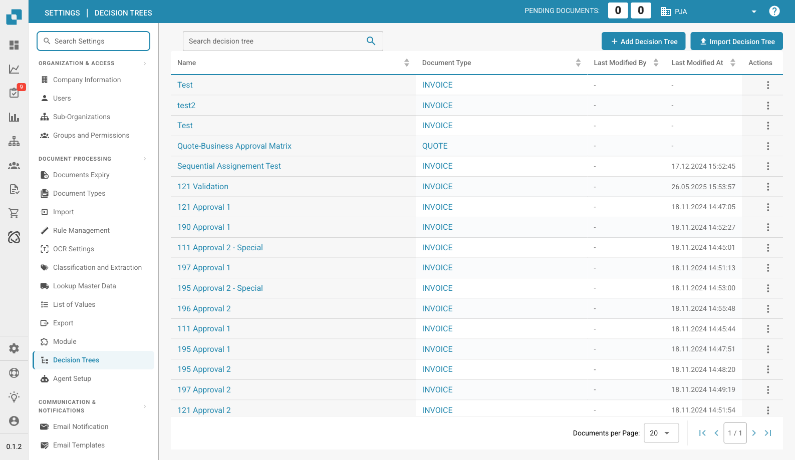

# Decision Trees

<figure><figcaption>
Decision Trees Page
</figcaption></figure>

Decision Trees allow you to define conditional logic that runs during document processing. Use them to automate approval workflows, validation steps, or routing decisions based on document field values.

## Decision Tree List

The table shows all configured decision trees:

| Column | Description |
|--------|-------------|
| **Name** | The name of the decision tree. Click to open the editor. |
| **Document Type** | Which document type this tree applies to (e.g., INVOICE, QUOTE). |
| **Last Modified By** | The user who last edited this tree. |
| **Last Modified At** | Timestamp of the last change. |
| **Actions** | Three-dot menu to edit, copy, export, or delete. |

## Creating a Decision Tree

1. Click **+ Add Decision Tree** in the top-right corner.
2. Enter a **Name** and select the **Document Type**.
3. Use the visual editor to define conditions and actions.

## Importing a Decision Tree

Click **Import Decision Tree** to upload a previously exported decision tree file (JSON format).

## Use Cases

* **Approval Workflows**: Route invoices to different approvers based on amount thresholds (e.g., amounts over 10,000 require manager approval).
* **Validation Rules**: Automatically validate field values and flag documents that don't meet criteria.
* **Sequential Assignment**: Assign documents to users in a specific order based on conditions.
