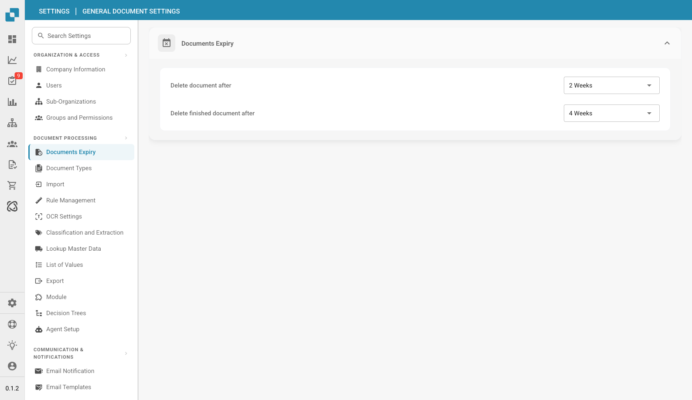

# Documents Expiry

<figure><figcaption>
Documents Expiry Settings
</figcaption></figure>

Documents Expiry controls how long documents are kept in DocBits before being automatically deleted. This helps manage storage and comply with data retention policies.

## Settings

| Setting | Description |
|---------|-------------|
| **Delete document after** | Sets how long unfinished documents remain in the system before automatic deletion. Options include: 48 Hours, 1 Week, 2 Weeks, 4 Weeks, 8 Weeks, No Limit. |
| **Delete finished document after** | Sets how long completed (exported) documents are kept before automatic deletion. Options include: 48 Hours, 1 Week, 2 Weeks, 4 Weeks, 8 Weeks, No Limit. |

## Important Notes

* **Unfinished documents** are documents still in processing, review, or pending approval.
* **Finished documents** are documents that have been fully processed and exported.
* Setting either option to **No Limit** means documents will not be automatically deleted.
* Deletion is permanent — make sure exported documents are backed up in your ERP or archive system before they expire.
