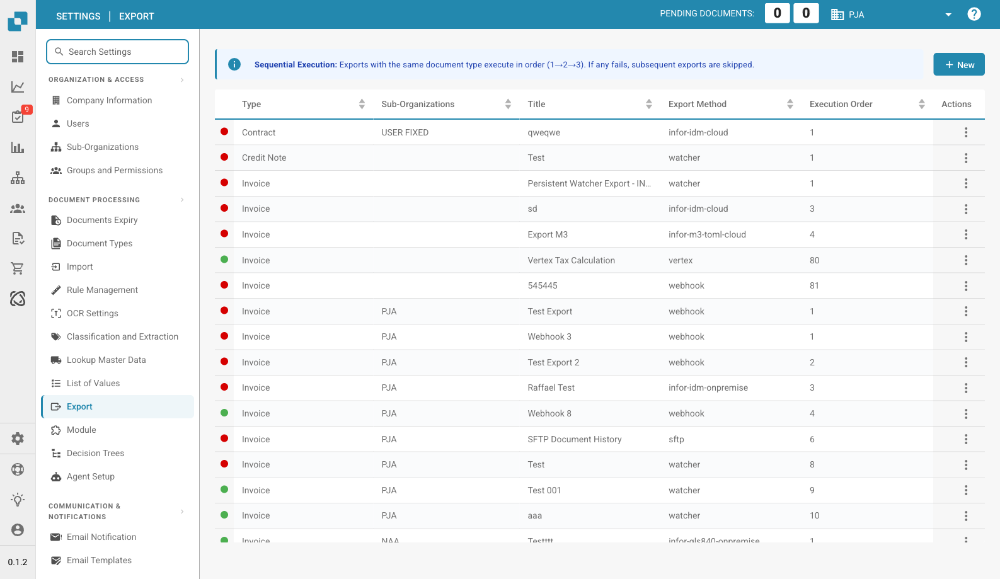

# Export

<figure><figcaption>
Export Settings Page
</figcaption></figure>

The Export page lets you configure how processed documents are sent from DocBits to your ERP system, file server, or external service. Each export configuration defines the method, target document type, and execution order.

## Export Table

Each row in the table represents one export configuration:

| Column | Description |
|--------|-------------|
| **Status** | Green = active, Red = inactive. |
| **Type** | The document type this export applies to (e.g., Invoice, Credit Note, Purchase Order Form). |
| **Sub-Organizations** | Which sub-organization this export is scoped to. Empty = applies to the main organization. |
| **Title** | A descriptive name for this export configuration. |
| **Export Method** | The integration method used (see below). |
| **Execution Order** | Determines the sequence when multiple exports exist for the same document type. Exports run in ascending order (1 → 2 → 3). |
| **Actions** | Three-dot menu to edit, activate/deactivate, or delete the export. |


**Sequential Execution**: Exports with the same document type execute in order (1→2→3). If any export fails, subsequent exports for that document type are skipped.


## Supported Export Methods

| Method | Description |
|--------|-------------|
| **webhook** | Send document data to an HTTP endpoint via POST request. |
| **watcher** | Export to a watched folder on the file system. |
| **sftp** | Transfer files via SFTP to a remote server. |
| **infor-idm-cloud** | Upload documents to Infor Document Management (Cloud). |
| **infor-idm-onpremise** | Upload documents to Infor Document Management (On-Premise). |
| **infor-m3-toml-cloud** | Export to Infor M3 via TOML format (Cloud). |
| **infor-m3-cloud** | Export to Infor M3 (Cloud). |
| **infor-m3-oc-charges-onpremise** | Export order charges to Infor M3 (On-Premise). |
| **infor-gls840-onpremise** | Export via Infor GLS840 interface (On-Premise). |
| **infor_sftp** | Export to Infor via SFTP. |
| **vertex** | Send data to Vertex for tax calculation. |

## Creating a New Export

1. Click **+ New** in the top-right corner.
2. Select the **Document Type** this export applies to.
3. Choose an **Export Method**.
4. Enter a **Title** for the export.
5. Configure the method-specific settings (e.g., URL, credentials, folder path).
6. Set the **Execution Order** if multiple exports exist for the same document type.
7. Click **Save**.
