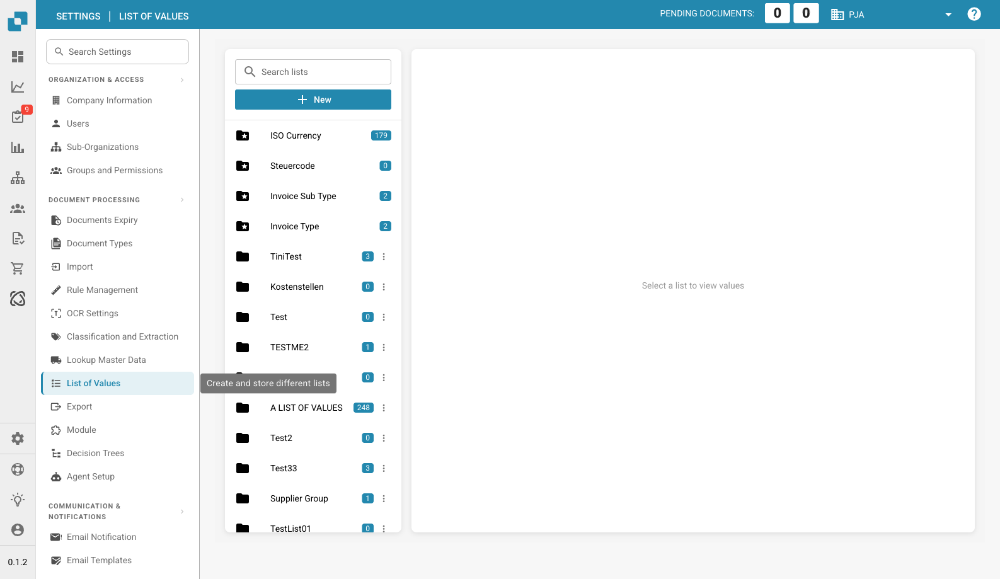

# List of Values

<figure><figcaption>
List of Values Page
</figcaption></figure>

List of Values allows you to create and manage predefined value lists used in dropdowns and data validation throughout DocBits. These lists ensure consistent data entry and can be linked to document fields.

## List Types

There are two types of lists:

* **System Lists** (blue folder icon): Pre-configured lists provided by DocBits (e.g., ISO Currency, Invoice Type, Invoice Sub Type). These cannot be deleted.
* **Custom Lists** (dark folder icon): Lists you create for your own needs (e.g., cost centers, tax codes). These can be edited and deleted via the actions menu (three dots).

The badge number next to each list shows how many values it contains.

## Viewing a List

Click on any list in the left panel to view its values in the right panel. Each value entry shows:

* **Value**: The actual value stored.
* **Display Name**: The label shown to users in dropdowns.
* **Description**: An optional description for reference.

## Creating a New List

1. Click **+ New** at the top of the left panel.
2. Enter a **List Name**.
3. Click **Save** to create the empty list.
4. Select the new list, then add values using the **Add** button in the right panel.

## Managing Values

* **Add**: Click **Add** to insert a new value into the selected list.
* **Edit**: Click on an existing value to modify it.
* **Delete**: Remove individual values from a list.
* **Import**: Some lists support bulk import via CSV.

## Use Cases

* **ISO Currency**: Dropdown for currency selection (EUR, USD, CHF, etc.).
* **Invoice Type / Sub Type**: Categorize invoices by type.
* **Cost Centers**: Map document line items to cost centers.
* **Tax Codes**: Predefined tax code selections for accounting.
