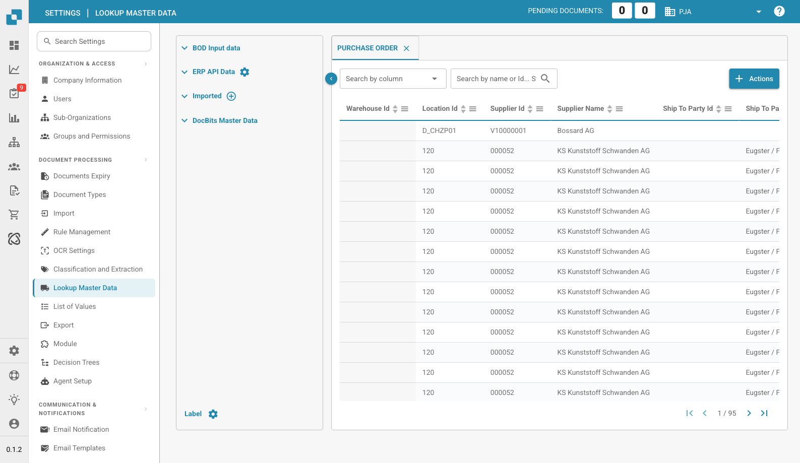

# Lookup Master Data

<figure><figcaption>
Lookup Master Data Page
</figcaption></figure>

Lookup Master Data allows you to view and manage the master data that DocBits uses to validate extracted document data against your ERP system. This is essential for accurate PO matching, supplier validation, and field auto-completion.

## Data Sources

The left panel shows four data source categories:

| Source | Description |
|--------|-------------|
| **BOD Input Data** | Data received via Infor BOD (Business Object Documents) messages. |
| **ERP API Data** | Data fetched directly from your ERP system via API. Click the gear icon to configure the API connection. |
| **Imported** | Manually imported data (e.g., via CSV upload). Click the **+** icon to add new data. |
| **DocBits Master Data** | Internal master data managed within DocBits. |

## Data Table

The right panel displays the master data in a searchable, sortable table:

* **Tabs**: Each tab represents a master data type (e.g., Purchase Order, Supplier, Item).
* **Search**: Filter data by column or search by name/ID.
* **Actions Menu**: Options to update column labels, hide empty columns, update aliases, or download data as CSV.
* **Pagination**: Navigate through large datasets using the page controls.

## Key Columns (Purchase Order Example)

The Purchase Order table includes columns such as: Warehouse ID, Location ID, Supplier ID, Supplier Name, PO Number, Line Number, Item ID, Description, Quantity, Unit Price, Total Amount, Currency, Status, and more.

## Label Configuration

At the bottom of the left panel, click **Label** (with gear icon) to customize how master data types are displayed and labeled throughout DocBits.
