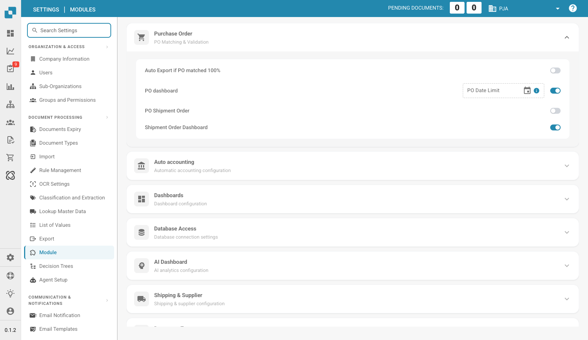

# Module

<figure><figcaption>
Module Settings Page
</figcaption></figure>

The Module page lets you enable or disable optional features in DocBits. Each section groups related modules that can be toggled on or off.

## Purchase Order

PO Matching & Validation settings.

| Setting | Description |
|---------|-------------|
| **Auto Export if PO matched 100%** | Automatically exports the document when PO matching reaches 100%. |
| **PO Dashboard** | Enables the Purchase Order dashboard. Includes a **PO Date Limit** field to restrict PO data by date. |
| **PO Shipment Order** | Enables shipment order processing linked to purchase orders. |
| **Shipment Order Dashboard** | Enables a dedicated dashboard for shipment orders. |

## Auto Accounting

| Setting | Description |
|---------|-------------|
| **Auto Accounting** | Enables automatic accounting for documents. Select the ERP type (e.g., LN, M3). |

## Dashboards

| Setting | Description |
|---------|-------------|
| **Advance Shipment Dashboard** | Dashboard for monitoring advanced shipment activities. |
| **Invoice Dashboard** | Dashboard for invoice monitoring and analytics. |
| **Full Text Search** | Enables full-text search across documents. |
| **Analytics Dashboard** | Enables the analytics overview dashboard. |

## Database Access

| Setting | Description |
|---------|-------------|
| **DB Access** | Enables direct database access for the organization. |

## AI Dashboard

| Setting | Description |
|---------|-------------|
| **AI Document Warehouse** | AI-powered document warehouse analytics. |
| **Dashboard v2** | Updated dashboard with improved features. |
| **Clickhouse Direct Access** | Enables direct Clickhouse database access. |
| **Supplier Statistics** | Enables supplier-level statistics and reporting. |

## Shipping & Supplier

| Setting | Description |
|---------|-------------|
| **Supplier Portal** | Enables the supplier portal for supplier collaboration. |

## Document Type

| Setting | Description |
|---------|-------------|
| **Workflow Builder** | Build and customize document processing workflows. |
| **Annotation Mode** | Allows users to annotate documents in the validation view. |
| **Show Report** | Enables report generation for documents. |
| **Inbound Emails** | Enables inbound email handling per document type. |
| **Models & Labels** | Manage AI models and labels for document recognition. |
| **Document Script** | Enables custom scripting for document processing. |
| **Document Scan** | Enables document scanning functionality. |
| **Bar-Code/QR Code Extraction** | Extracts barcode/QR code data from documents. Select supported code types. |
| **Custom Master Data** | Enables custom master data fields. |
| **Tasks & Notifications** | Enables task management and notification features. Includes **Dashboard Tasks Count** toggle. |
| **DocBits Operator** | Enables the DocBits Operator browser automation feature. |
| **DocNet** | Enables DocNet document networking. |
| **IDM ACL Updater** | Updates Infor Document Management access control lists. Upload an ION-Mapping file and configure Infor-Doctype to ACL mappings. |
| **Barcode Assignment** | Enables barcode assignment to documents. |
| **Set Negative Sign For Credit Notes** | Automatically applies negative signs to credit note amounts. |

## BOD Connection Stream

| Setting | Description |
|---------|-------------|
| **BOD Connection Stream** | Enables BOD (Business Object Document) integration. Shows the **Stream Name** used for the connection. |

## Analytics

| Setting | Description |
|---------|-------------|
| **Use PostgreSQL for Quality Analytics** | Switch between Prometheus (real-time, resets on deploy) and PostgreSQL (persistent 90 days, trend analysis, worst-performing fields). |

## Vertex Tax Integration

| Setting | Description |
|---------|-------------|
| **Vertex Tax Integration** | Enables Vertex tax calculation. Configure **Base URL**, **Client ID**, and **Client Secret**. Use **Test Connection** to verify. |
