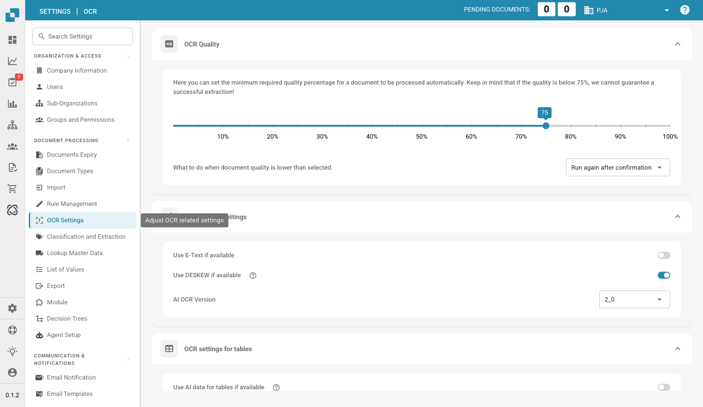

# OCR Settings

<figure><figcaption>
OCR Settings Page
</figcaption></figure>

OCR (Optical Character Recognition) Settings control how DocBits reads and extracts text from your documents. This page is organized into four sections.

## OCR Quality

Set the minimum required quality percentage for a document to be processed automatically.

* **Quality Slider**: Drag to set the threshold (10%–100%). Documents below this quality will not be auto-processed.
* **Below 75% Warning**: If quality is below 75%, DocBits cannot guarantee successful extraction.
* **What to do when document quality is lower than selected**: Choose the fallback behavior:
  * **Run again after confirmation** — Re-run OCR after manual confirmation.
  * **Skip** — Skip the document entirely.

## General OCR Settings

| Setting | Description |
|---------|-------------|
| **Use E-Text if available** | When enabled, DocBits uses embedded electronic text (e.g., from digital PDFs) instead of running OCR. This improves accuracy for digitally-created documents. |
| **Use DESKEW if available** | Automatically straightens tilted or skewed scanned documents before OCR processing. |
| **AI OCR Version** | Select the OCR engine version (e.g., 2_0). Newer versions may offer better recognition. |

## OCR Settings for Tables

| Setting | Description |
|---------|-------------|
| **Use AI data for tables if available** | When enabled, uses AI-powered extraction for table data, which can improve accuracy for complex table structures. |

## OCR Settings for Header Fields

Controls how header fields (non-table data) are extracted:

| Setting | Description |
|---------|-------------|
| **Use Rules Extraction** | Extract header fields using predefined rules and patterns. |
| **Use AI Extraction** | Extract header fields using AI-based recognition. |


If both Rules Extraction and AI Extraction are enabled, they run sequentially: Rules Extraction first, then AI Extraction.

