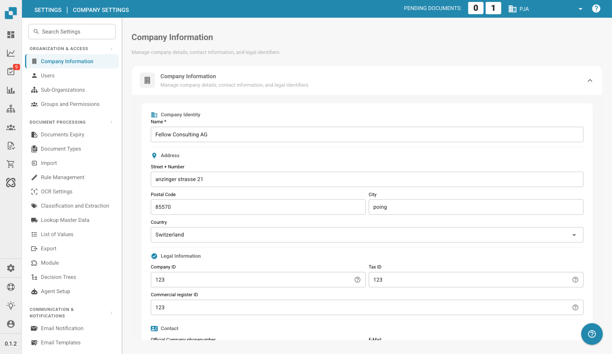

# Company Information

<figure><figcaption>
Company Information Page
</figcaption></figure>

The Company Information page lets you manage your company profile, preferences, and subscription details. It is organized into the following sections:

## Company Information

This section contains your core company data, grouped into four areas:

### Company Identity

* **Name** *(required)*: The legal name of your company.

### Address

* **Street + Number**: Your company's street address.
* **Postal Code**: ZIP or postal code.
* **City**: City name.
* **Country**: Select your country from the dropdown.

### Legal Information

* **Company ID**: A unique identifier for your company, used for integrations and internal reference.
* **Tax ID**: Your tax identification number for financial reporting.
* **Commercial Register ID**: Your commercial register number for legal documentation.

### Contact

* **Official Company Phone Number**: The primary phone number for your company.
* **E-Mail**: The main email address used for official communications.

After entering or updating any fields, click **Save** to apply your changes.

## Company Preferences

Configure company-wide default settings:

* **Date Pattern**: Choose how dates are displayed throughout DocBits (e.g., `%m/%d/%Y`, `%d.%m.%Y`).
* **Amount Formatting**: Select the number format for amounts (e.g., Deutsch for `1.000,00`, English for `1,000.00`).
* **New Version Info Dialog**: Toggle whether users see a notification when a new DocBits version is released.

Click **Save** after making changes.

## App-Color

Customize the primary color of the DocBits interface. This is useful for visually distinguishing different environments (e.g., dev vs. production).

* **Color**: Enter a hex color code (e.g., `#2388AE`) or use the color picker.
* Click **Save** to apply, or **Reset** to restore the default color.

## Subscription Plan

View your active subscription plans and their details:

* **Plan Name**: The name of each active plan (e.g., DocBits, DocFlow Users, DocSearch).
* **Days Left**: How many days remain until the plan expires.
* **Start Date / End Date**: The subscription period.
* **Users Count**: Total number of users in your organization.
* **Sub Organizations Count**: Number of sub-organizations configured.
* **Suppliers Count**: Number of suppliers registered.

## Subscription Usage

Monitor your monthly token and workflow consumption:

| Column | Description |
|--------|-------------|
| **Type** | The usage type (Document or Workflow). |
| **From / To** | The billing period dates. |
| **Tokens Used** | Number of tokens consumed in the current period. |
| **Remaining Tokens** | Tokens still available in the current period. |

Use the **Select** button to filter by specific date ranges.
