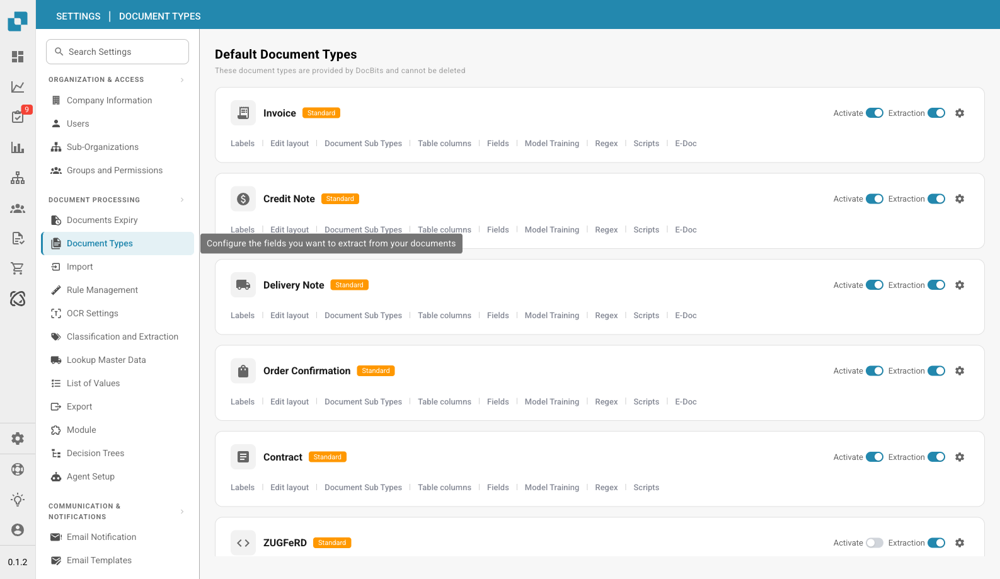

# Document Types


DocBits Document Types Explained: Create, Configure & Assign Processing Settings


<figure><figcaption>
Document Types Page
</figcaption></figure>

## Overview

The Document Types page lists all document types recognized and processed by DocBits. It is divided into two sections:

* **Default Document Types**: Pre-configured types provided by DocBits (Invoice, Credit Note, Delivery Note, Order Confirmation, Contract, ZUGFeRD, etc.). These cannot be deleted.
* **Custom Document Types**: Types you create for your specific business needs. These can be edited and deleted.

## Controls per Document Type

Each document type card shows:

| Control | Description |
|---------|-------------|
| **Activate** | Toggle to enable or disable this document type for processing. |
| **Extraction** | Toggle to enable or disable AI-based data extraction for this type. |
| **Settings** (gear icon) | Open additional configuration options for the document type. |

## Configuration Tabs

Below each document type, you can access the following configuration tabs:

| Tab | Description |
|-----|-------------|
| **Labels** | Manage display labels and translations for the document type. |
| **Edit layout** | Modify how the document appears in the validation view, including field positions. |
| **Document Sub Types** | Configure subcategories for this document type (e.g., different invoice formats). |
| **Table columns** | Customize which data columns appear in the line items table. |
| **Fields** | Manage the data fields extracted from the document (add, edit, or remove fields). |
| **Model Training** | Configure and train the AI model used for recognizing and extracting data. |
| **Regex** | Set up regular expressions for pattern-based data extraction. |
| **Scripts** | Write custom processing scripts that run during document processing. |
| **E-Doc** | Configure electronic document standards (XRechnung, ZUGFeRD, EDI, FatturaPA). |

## Creating a Custom Document Type

1. Scroll down to the **Custom Document Types** section.
2. Click **+ New**.
3. Enter a name for the new document type.
4. Configure the fields, layout, and extraction settings as needed.


See [Setup Document Type](../../../setup/document-types/) for detailed setup instructions.

