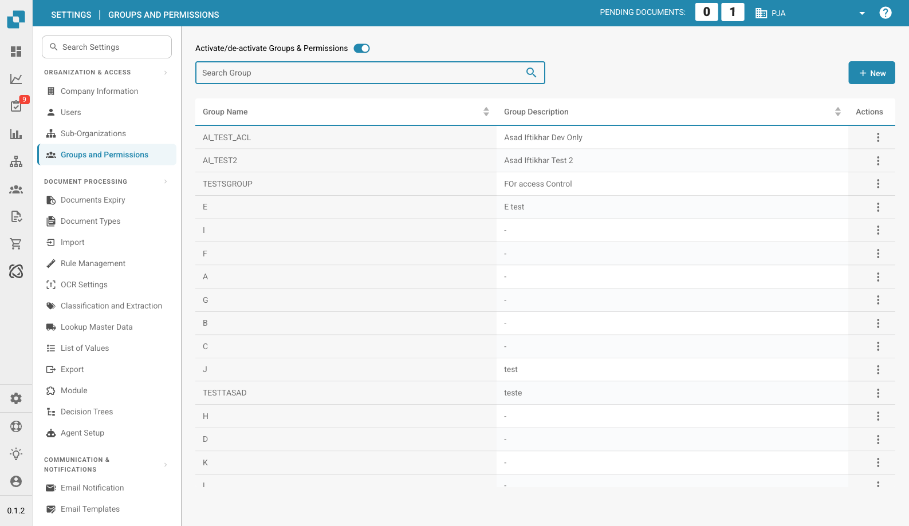

# Groups and Permissions


DocBits Groups & Permissions Tutorial: Set User Roles, Access Rights & Secure Your Workspace


<figure><figcaption>
Groups and Permissions Page
</figcaption></figure>

Groups and Permissions allow you to control which users can access specific document types and what actions they can perform.

## Activate/Deactivate Groups & Permissions

Use the toggle at the top of the page to enable or disable the groups and permissions system. When disabled, the system uses a simpler access model without group-based restrictions.

## Group List

The table displays all configured groups with:

| Column | Description |
|--------|-------------|
| **Group Name** | The name of the group. |
| **Group Description** | A brief description of the group's purpose. |
| **Actions** | Menu with options to edit or delete the group. |

Use the **Search** bar to find groups by name. Click **+ New** to create a new group.

## Configuring Group Permissions

When you select a group (via the Actions menu → Edit), a permissions table appears where you can configure access per document type:

| Permission | Description |
|------------|-------------|
| **View** | Permission to see documents of this type. |
| **Update** | Permission to modify documents of this type. |
| **Delete** | Permission to remove documents of this type. |
| **First Approval** | Permission to perform the initial approval. |
| **Second Approval** | Permission to perform a secondary level of approval (if applicable). |

Each row in the permissions table represents a document type (e.g., Invoice, Credit Note, Delivery Note). Check or uncheck the boxes to grant or revoke permissions for that group.

## Creating a New Group

1. Click **+ New** in the top-right corner.
2. Enter a **Group Name** and optional **Description**.
3. Configure the permissions for each document type.
4. Assign users to the group.
5. Click **Save** to apply.
