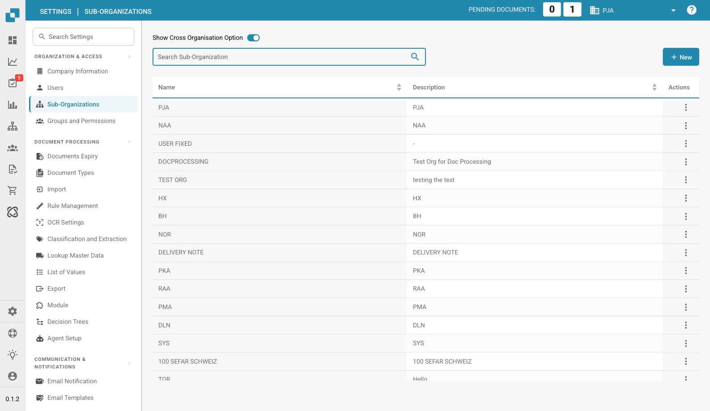

# Sub-Organizations

<figure><figcaption>
Sub-Organizations Page
</figcaption></figure>

Sub-organizations allow you to create a hierarchical structure within DocBits to manage documents, users, and workflows across different departments, teams, or entities.

## Key Benefits

* **Structured Organization**: Group users and documents by department, location, or business unit.
* **Granular Permissions**: Control which users can access documents in each sub-organization.
* **Separate Workflows**: Each sub-organization can have its own document processing rules and configurations.
* **Reporting**: Generate reports and analytics per sub-organization.

## Sub-Organization List

The table displays all existing sub-organizations with:

| Column | Description |
|--------|-------------|
| **Name** | The name of the sub-organization. |
| **Description** | A brief description of the sub-organization's purpose. |
| **Actions** | Menu with options to edit or delete the sub-organization. |

Use the **Search** bar to quickly find sub-organizations by name.

## Creating a New Sub-Organization

1. Click the **+ New** button in the top-right corner.
2. Enter a **Name** and optional **Description**.
3. Click **Save** to create the sub-organization.

## Show Cross Organisation Option

When enabled (toggle at the top of the page), users can access documents across all sub-organizations from a single view.

### How to Use Cross Sub-Organisations

1. Navigate to the **Dashboard**.
2. In the top-right corner, where sub-organizations can be switched, select **Cross**.
3. The page reloads, showing documents from all sub-organizations.
4. To return to a single sub-organization view, deselect the **Cross** option.

This is useful for administrators who need a centralized overview of all documents across the organization.
