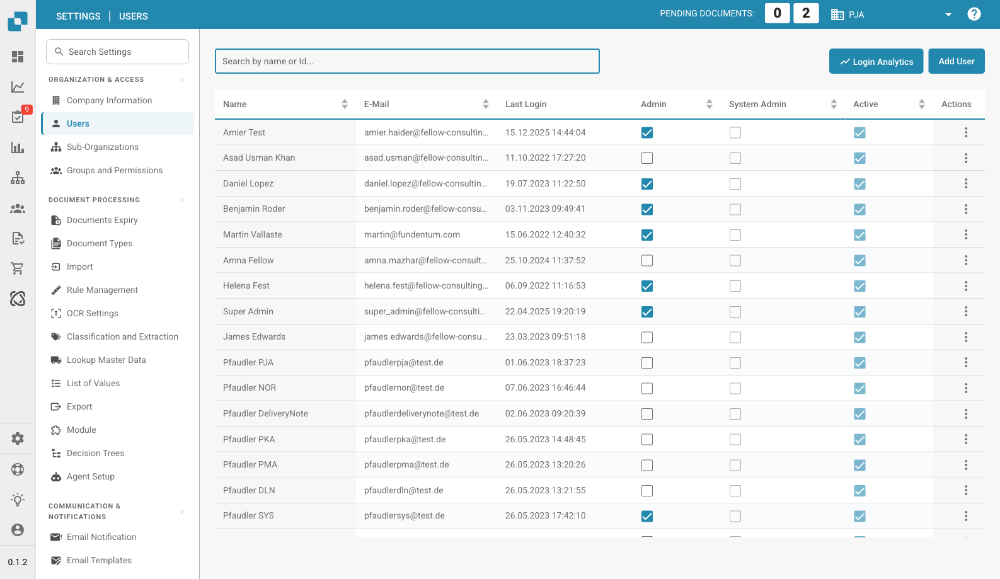

# Users

<figure><figcaption>
Users Management Page
</figcaption></figure>

The Users page allows administrators to manage all user accounts in your DocBits organization. Here you can add new users, assign roles, and control access.

## User List

The user table displays the following columns:

| Column | Description |
|--------|-------------|
| **Name** | The full name of the user. |
| **E-Mail** | The user's email address, used as their login identifier. |
| **Last Login** | Date and time of the user's most recent login. |
| **Admin** | Checkbox indicating whether the user has administrator privileges. Admins can access all settings and manage other users. |
| **System Admin** | Checkbox indicating whether the user has system administrator privileges, granting full system-level access. |
| **Active** | Checkbox showing whether the user account is currently active. Inactive users cannot log in. |
| **Actions** | Menu with options such as editing user details, resetting passwords, or deactivating the account. |

Use the **Search** bar at the top to quickly find users by name or ID.

## Login Analytics

Click **Login Analytics** to view login activity data across your organization, including login frequency and patterns.

## Adding a New User

1. Click the **Add User** button in the top-right corner.
2. Fill in the required information:
   * **Username**: A unique name for the user.
   * **First Name** and **Last Name**: The user's full name.
   * **Email Address**: Used for login and notifications.
   * **Password**: Must comply with your organization's security policies.
   * **User Role**: Assign the appropriate role (Standard User, Admin, or System Admin).
3. Click **Save** to create the user account. The new user will receive an email notification with their login details.
