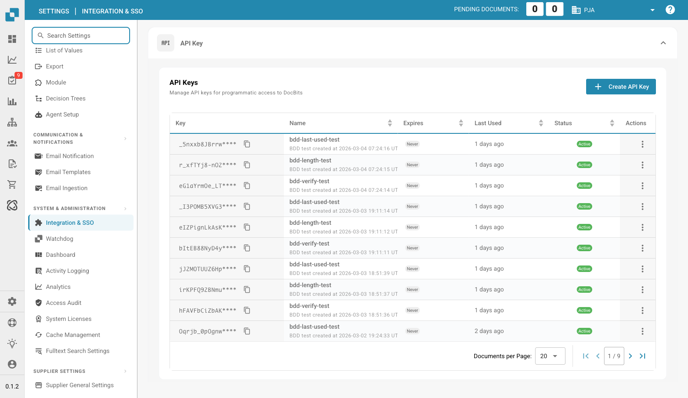

# Integration & SSO

<figure><figcaption>
Integration & SSO Page
</figcaption></figure>

The Integration & SSO page manages API keys for programmatic access, organization IDs, and Single Sign-On (SSO) configuration.

## API Key

Manage API keys used for programmatic access to DocBits.

| Column | Description |
|--------|-------------|
| **Key** | The masked API key value. Click the copy icon to copy the full key. |
| **Name** | A descriptive name for the key. |
| **Expires** | Expiration date (or "Never"). |
| **Last Used** | When the key was last used. |
| **Status** | Active or Inactive. |
| **Actions** | Three-dot menu to revoke or delete. |

Click **+ Create API Key** to generate a new key.

## ID

Shows your organization identifiers:

| Field | Description |
|-------|-------------|
| **Org ID** | Your organization's unique identifier. |
| **Sub Org ID** | The currently selected sub-organization ID. |

## SSO Service Provider Settings

DocBits SSO configuration values needed when setting up your Identity Provider:

| Field | Description |
|-------|-------------|
| **Entity ID** | The SAML metadata URL for DocBits. |
| **SLO URL** | Single Logout URL. |
| **SSO URL** | Assertion Consumer Service URL. |

You can also **Download Certificate** and **Download Metadata** for your IdP configuration.

## Identity Service Provider Settings

Configure your external Identity Provider (IdP):

| Field | Description |
|-------|-------------|
| **Tenant ID** | Your IdP tenant identifier. |
| **Upload file** | Upload your IdP metadata XML file. |

Click **Configure** to save your IdP settings.

* **Increased efficiency:** Integration with other tools and services can streamline workflows and increase efficiency. For example, documents can be automatically exchanged between Docbits and a CRM system, reducing manual entry and increasing productivity
* **Data consistency:** Integration allows data to be exchanged seamlessly between different systems, improving data consistency and accuracy. This avoids inconsistencies or duplicate data entry that could lead to errors.
* **Real-time updates**: Integration enables real-time updates between different platforms so that users always have the latest information. This is especially important for critical business processes that require real-time information.
* **Task automation:** Integration allows routine tasks to be automated, saving time and resources. For example, notifications can be triggered automatically when a certain event occurs in another system without the need for manual intervention.
* **Improved user experience:** A well-configured integration ensures a seamless user experience as users do not have to switch between different systems to access relevant information. This improves user satisfaction and contributes to efficiency.

To properly configure the integration settings, it is important to understand the organization's requirements and ensure that the integration is seamlessly integrated into existing workflows and processes. This requires thorough planning, configuration, and monitoring of the integration to ensure that it works smoothly and delivers the desired value.

