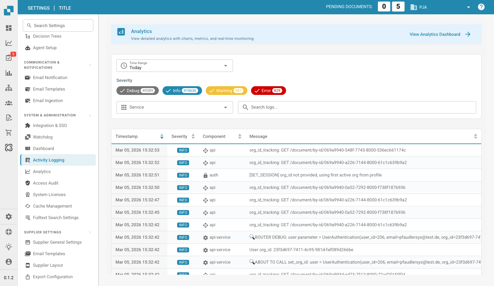

# Activity Logging

<figure><figcaption>
Activity Logging Page
</figcaption></figure>

Activity Logging provides a real-time view of system events across all DocBits services. Use it to monitor processing activity, troubleshoot errors, and audit system behavior.

## Analytics Banner

At the top of the page, a banner links to the **Analytics Dashboard** for charts, metrics, and real-time monitoring.

## Filters

| Filter | Description |
|--------|-------------|
| **Time Range** | Select a time window (e.g., Today, Last 7 Days, Last 30 Days). |
| **Severity** | Toggle severity levels to include or exclude: **Debug**, **Info**, **Warning**, **Error**. Each chip shows the current count. |
| **Service** | Filter logs by service (e.g., api, auth, api-service). |
| **Search logs** | Free-text search across log messages. |

## Log Table

| Column | Description |
|--------|-------------|
| **Timestamp** | Date and time the event occurred. Sortable. |
| **Severity** | Color-coded badge: Info (blue), Warning (yellow), Error (red), Debug (gray). |
| **Component** | The service or module that generated the log (e.g., api, auth, api-service). |
| **Message** | The full log message with event details. |

Results are paginated — use the controls at the bottom to navigate pages.

## Footer Actions

| Action | Description |
|--------|-------------|
| **Auto-refresh** | Toggle to automatically refresh the log view at regular intervals. |
| **Refresh Now** | Manually refresh the log data. |
| **Export JSON** | Export the current filtered logs as a JSON file. |
| **Download Logs** | Download the complete log data. |
