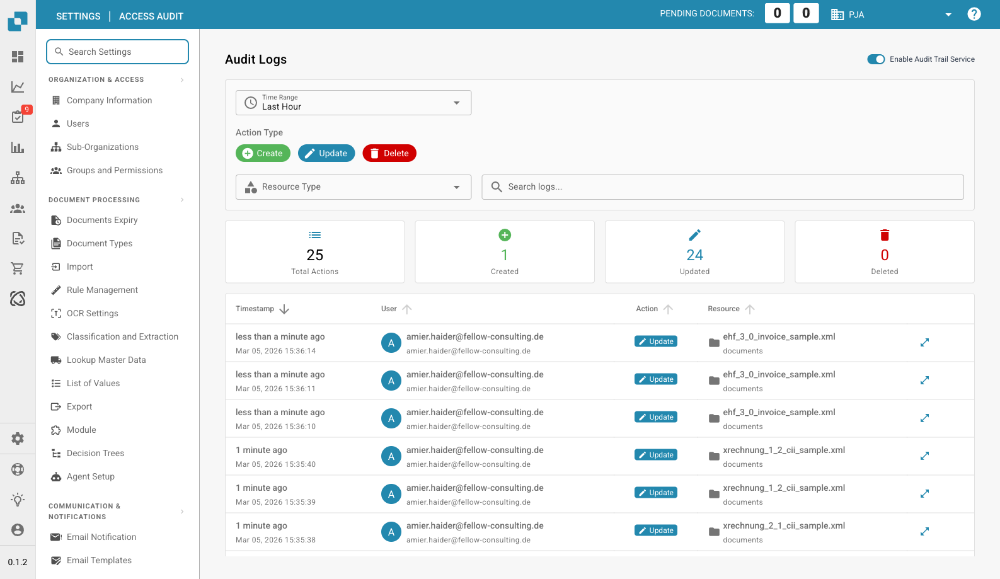

# Access Audit

<figure><figcaption>
Access Audit Page
</figcaption></figure>

The Access Audit page (Audit Logs) tracks all create, update, and delete actions performed by users across DocBits. Use it to monitor who changed what and when.

## Enable Audit Trail Service

Use the toggle in the top-right corner to enable or disable audit logging globally.

## Filters

| Filter | Description |
|--------|-------------|
| **Time Range** | Select a time window (e.g., Last Hour, Today, Last 7 Days). |
| **Action Type** | Filter by action: **Create** (green), **Update** (blue), **Delete** (red). |
| **Resource Type** | Filter by resource type (e.g., documents, settings). |
| **Search logs** | Free-text search across audit entries. |

## Summary Cards

| Card | Description |
|------|-------------|
| **Total Actions** | Total number of audit events in the selected period. |
| **Created** | Number of create actions. |
| **Updated** | Number of update actions. |
| **Deleted** | Number of delete actions. |

## Audit Log Table

| Column | Description |
|--------|-------------|
| **Timestamp** | When the action occurred (relative and absolute time). |
| **User** | The user who performed the action (email and avatar). |
| **Action** | Color-coded action badge: Create, Update, or Delete. |
| **Resource** | The affected resource name and type (e.g., document filename). |
| **Details** | Click the arrow icon to view full details of the change. |
