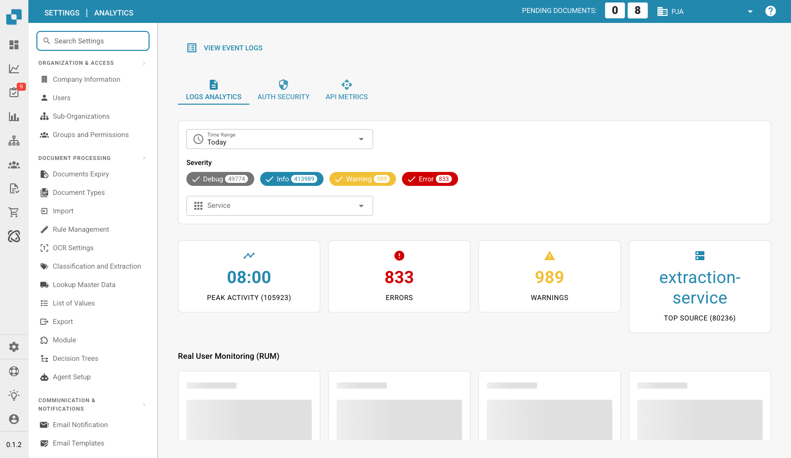

# Analytics

<figure><figcaption>
Analytics Page
</figcaption></figure>

The Analytics page provides visual dashboards for monitoring system health, log patterns, and API usage. It links directly to the Activity Logging page via the **View Event Logs** button.

## Tabs

| Tab | Description |
|-----|-------------|
| **Logs Analytics** | Log severity distribution, timeline charts, and service breakdown. |
| **Auth Security** | Authentication events, login attempts, and security-related metrics. |
| **API Metrics** | API request volumes, response times, and error rates. |

## Filters

| Filter | Description |
|--------|-------------|
| **Time Range** | Select a time window (e.g., Today, Last 7 Days). |
| **Severity** | Toggle severity levels: Debug, Info, Warning, Error. Each shows current count. |
| **Service** | Filter by service name. |

## Summary Cards

Four summary cards appear below the filters:

| Card | Description |
|------|-------------|
| **Peak Activity** | Time of day with the highest log volume and total count. |
| **Errors** | Total error count for the selected period. |
| **Warnings** | Total warning count for the selected period. |
| **Top Source** | The service producing the most logs with its count. |

## Real User Monitoring (RUM)

Below the summary cards, RUM metrics show frontend performance data collected from real user browser sessions.

## Analytics Charts

Toggle between three chart views:

| View | Description |
|------|-------------|
| **Severity** | Pie chart showing log level distribution (Debug, Info, Warning, Error). |
| **Timeline** | Line chart showing log volume over time. |
| **Service** | Bar chart breaking down logs by service. |
