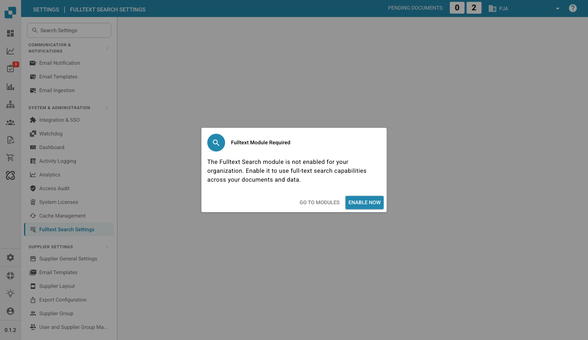

# Fulltext Search Settings

<figure><figcaption>
Fulltext Search Settings — Module Required Dialog
</figcaption></figure>

Fulltext Search Settings configures the full-text search capabilities across your documents and data. This feature requires the **Fulltext Search module** to be enabled.

## Prerequisites

The Fulltext Search module must be activated in **Settings → Document Processing → Module → Dashboards → Full text search**. If the module is not enabled, a dialog will prompt you to either:

* **Go to Modules** — Navigate to the Module settings page to review the configuration.
* **Enable Now** — Activate the Fulltext Search module directly (starts a DocSearch subscription).

## Features

Once enabled, Fulltext Search allows users to:

* Search across all document content (not just metadata fields)
* Find documents by text contained within uploaded files
* Use advanced search operators for precise queries
* Access search results directly from the dashboard
