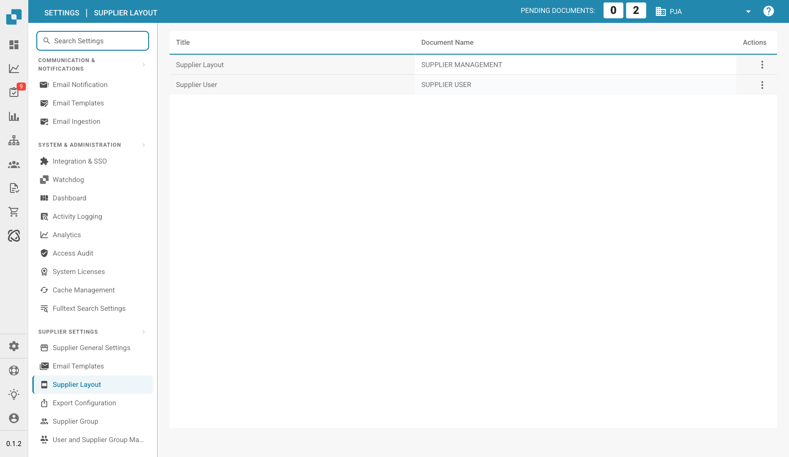

# Supplier Layout

<figure><figcaption>
Supplier Layout Page
</figcaption></figure>

This is where you decide what information you want to include and define what information is needed. You can easily design your layout using the drag-and-drop functions.

You can use it to create layouts for supplier users and for supplier management.