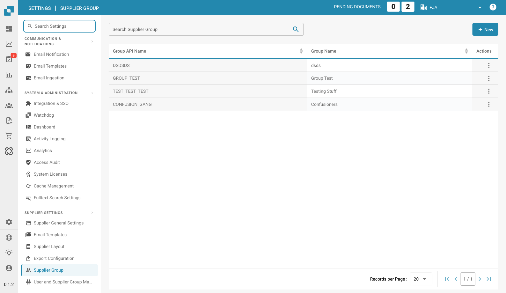
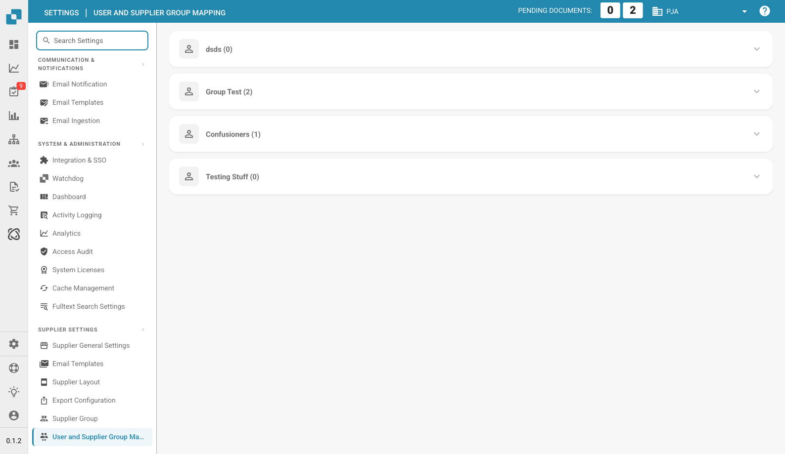

# Supplier Permissions

### Supplier Group

<figure><figcaption>
Supplier Group Page
</figcaption></figure>

Manage supplier groups to categorize suppliers by type, region, or role. Each group has a **Group API Name** (used for integrations) and a **Group Name** (display name).

Click **+ New** to create a group. Use the three-dot menu on each row to edit or delete.

### User and Supplier Group Mapping

<figure><figcaption>
User and Supplier Group Mapping Page
</figcaption></figure>

Assign users to supplier groups to control which employees can access and manage specific sets of suppliers. Each group is shown as an expandable section listing its assigned users with a member count.

Click **+ New** within a group to add a user mapping. Use the three-dot menu to remove a mapping.
