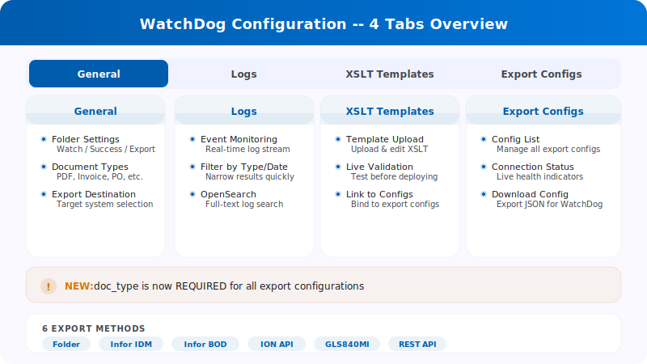
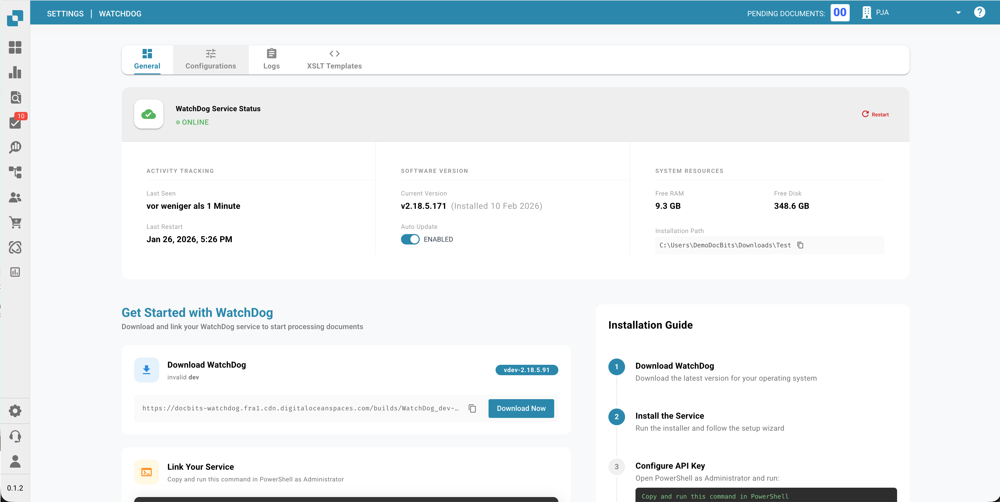
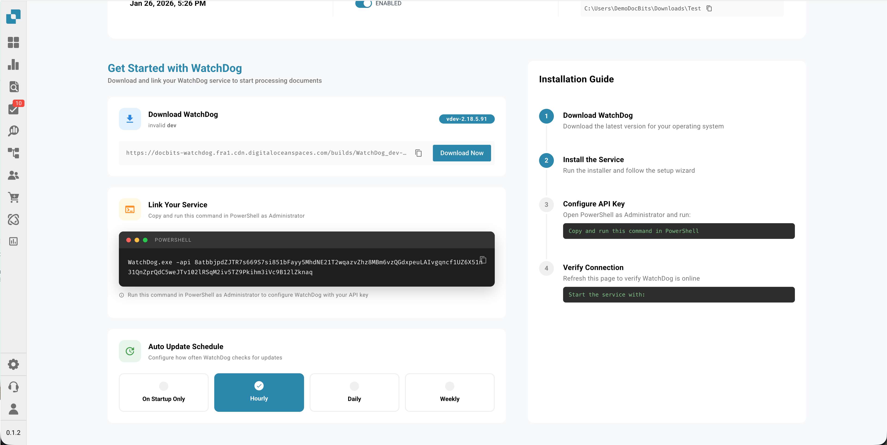
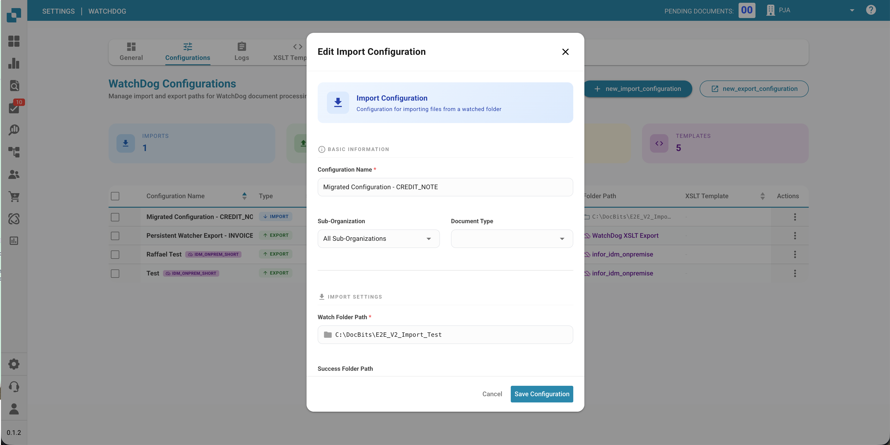
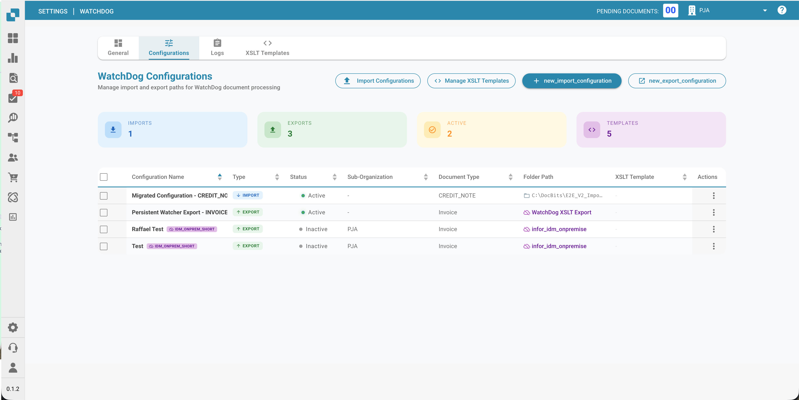
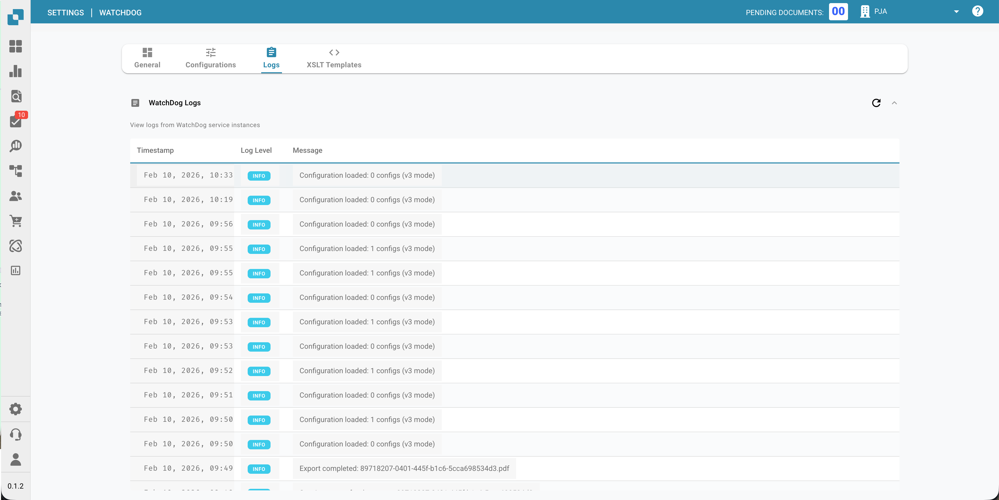
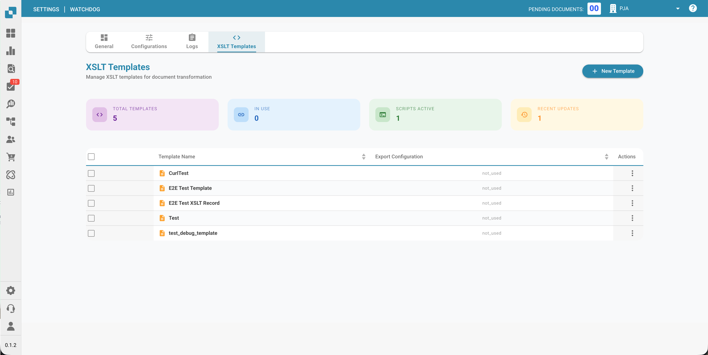
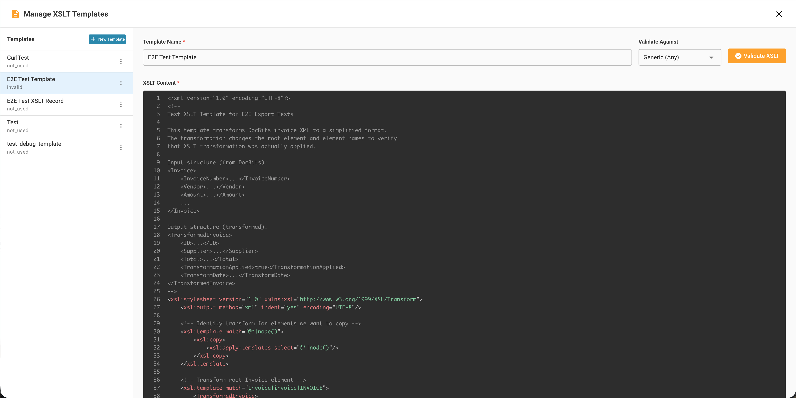

# WatchDog Configuration

This guide explains how to configure the WatchDog service within the DocBits application. All configurations are managed directly in **Settings → Document Processing → WatchDog**.

<figure><figcaption></figcaption></figure>

---

## 1. General Tab

The General tab provides setup instructions, download links, and update settings.

<figure><figcaption></figcaption></figure>

### 1.1 Download & Setup

* Download the latest `WatchDog.exe` directly from the General tab
* Copy the displayed API Key
* Run the configuration command in an Administrator Command Prompt:

```powershell
WatchDog.exe -api YOUR_API_KEY
```

### 1.2 Auto-Update Schedule

| Option | Interval |
| :--- | :--- |
| On Startup Only | Check once at start |
| Hourly | Every 3600 seconds |
| Daily | Every 86400 seconds |
| Weekly | Every 604800 seconds |

---

## 2. Configurations Tab

Create and manage import and export configurations. All configurations are created directly in DocBits — no local config files needed.

### 2.1 Import Configurations

Define where WatchDog monitors for new documents.

<figure><figcaption></figcaption></figure>

| Field | Description |
| :--- | :--- |
| **Name** | Display name for this configuration |
| **Watch Folder** | Directory to monitor for new documents (required) |
| **Success Folder** | Where files are moved after successful import |
| **Document Type** | INVOICE, CREDIT\_NOTE, PURCHASE\_ORDER, etc. |
| **Sub-Organisation** | Optional — route documents to a specific sub-org |

### 2.2 Export Configurations

Define how and where processed documents are exported.

> **Important:** Export configurations now **require a document type** (`doc_type`). Configurations without a document type will be rejected by the system.

| Field | Description |
| :--- | :--- |
| **Name** | Display name for this configuration |
| **Document Type** | Required — INVOICE, CREDIT\_NOTE, etc. |
| **Export Method** | How documents are exported (see below) |
| **Export Folder** | Target directory for folder exports |
| **Execution Order** | Priority when multiple configs match (default: 1) |
| **XSLT Template** | Optional — XML transformation template |

### 2.3 Export Methods

| Method | Description |
| :--- | :--- |
| **Folder (watcher)** | Export PDF + XML to a local folder |
| **Infor IDM** | Upload to Infor Document Management |
| **Infor BOD** | Send BOD XML to Infor LN/M3 |
| **ION API** | Call Infor ION API endpoints |
| **GLS840MI** | M3 batch processing (via REST API) |
| **REST API** | Send to external API with ION OAuth authentication |

<figure><figcaption></figcaption></figure>

### 2.4 Processing Options

<figure><figcaption></figcaption></figure>

* **Barcode Divider:** Automatically split multi-page documents based on barcodes
* **DocBits Operator:** Enable browser automation tasks

---

## 3. Status Tab

Monitor WatchDog service health and activity.

### Status Information

| Field | Description |
| :--- | :--- |
| **Online/Offline** | Current connection status (30s heartbeat threshold) |
| **Version** | Installed WatchDog version |
| **Version First Seen** | When this version was first reported |
| **Last Restart** | Timestamp of last service restart |
| **Auto-Update Enabled** | Whether automatic updates are active |
| **Latest Version** | Newest available version |
| **Latest Version Checked At** | When the latest version was last checked |
| **System Info** | Installation path, free RAM, free disk space |

### Health Indicator

| Status | Meaning |
| :--- | :--- |
| ✅ **Online** | WatchDog is connected and active |
| ⚠️ **Offline** | No heartbeat received for 30+ seconds |
| ❌ **Not Installed** | WatchDog has never connected to this organisation |

---

## 4. Logs Tab

View all WatchDog events stored in OpenSearch.

<figure><figcaption></figcaption></figure>

* Filter by date, event type, or keywords
* Event types: `FILE_IMPORT_STARTED`, `FILE_IMPORT_COMPLETED`, `FILE_IMPORT_FAILED`, `EXPORT_STARTED`, `EXPORT_COMPLETED`, `EXPORT_FAILED`, `FOLDER_VALIDATION_FAILED`, `CONFIG_LOADED`, `SERVICE_RESTART_INITIATED`, `SERVICE_RESTART_COMPLETED`

---

## 5. XSLT Templates Tab

Manage XSLT transformation templates used for XML exports.

<figure><figcaption></figcaption></figure>

* Upload and edit XSLT templates
* **Live validation** — test templates against sample XML with field analysis
* Link templates to export configurations
* View usage count (which configs use each template)

---

## 6. Export Configurations Tab

Overview of all active export configurations with connection status.

<figure><figcaption></figcaption></figure>

* Monitor the last successful connection timestamp
* Manage configurations inline (edit, copy, delete)
* Bulk copy configurations across sub-organisations
