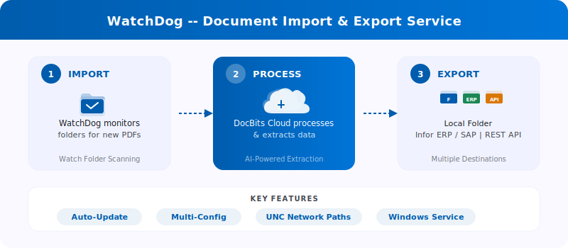
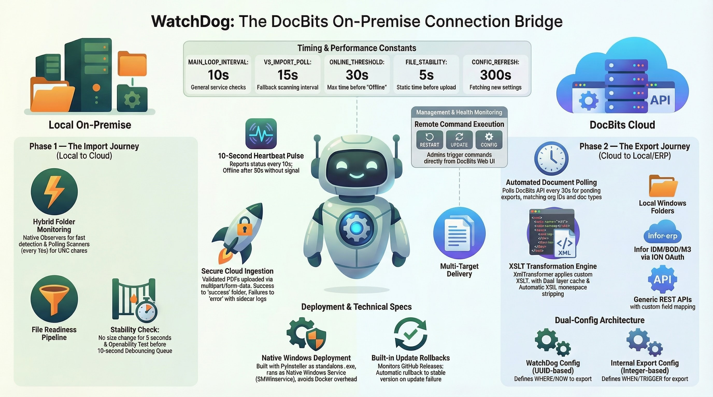

# WatchDog

<figure><figcaption></figcaption></figure>

<figure><figcaption></figcaption></figure>

**WatchDog** is a Windows-based on-premise service that monitors local folders for incoming documents, uploads them to the DocBits Cloud for processing, and exports finished documents back to local folders or ERP systems.

## Key Features

* **Automatic folder monitoring** — watches local paths and UNC network paths for new PDFs
* **Multi-config support** — multiple import/export configurations per instance
* **6 export methods** — Local Folder, Infor IDM, Infor BOD, ION API, GLS840MI, REST API
* **Auto-Update** — automatic version updates with rollback on failure
* **Remote management** — restart, update, and configure via DocBits UI

## Quick Start

### 1. Download WatchDog

Download `WatchDog.exe` from **Settings → Document Processing → WatchDog → General Tab** in the DocBits application.

### 2. Configure via API Key

Open **Command Prompt as Administrator** and run:

```powershell
WatchDog.exe -api YOUR_API_KEY
```

> **Note:** The API Key is available in your DocBits Settings under the WatchDog General Tab. This connects WatchDog to your DocBits organisation.

### 3. Install as Windows Service

```powershell
WatchDog.exe install
WatchDog.exe start
```

### 4. Create Configurations in DocBits

All import and export configurations are created directly in the **DocBits application**:

**Settings → Document Processing → WatchDog → Configurations Tab**

* **Import Configurations** — define watch folders and document types
* **Export Configurations** — define export destinations, XSLT templates, and export methods

> **Important:** Export configurations require a **document type** (`doc_type`). Configurations without a document type will be rejected.

### 5. Auto Start (Optional)

To start WatchDog automatically on boot:

1. Open **Services** (`Win + R` → `services.msc`)
2. Find **WatchDog** in the list
3. Set **Startup Type** to **Automatic (Delayed Start)**

## Command Reference

| Command | Description |
| :--- | :--- |
| `WatchDog.exe -api KEY` | Configure API Key and connect to DocBits |
| `WatchDog.exe install` | Install as Windows Service |
| `WatchDog.exe start` | Start the service |
| `WatchDog.exe stop` | Stop the service |
| `WatchDog.exe debug` | Run in console mode for troubleshooting |
| `WatchDog.exe --version` | Show current version |
| `WatchDog.exe --list-folders` | List configured watch folders |
| `WatchDog.exe remove` | Uninstall the service |

## Further Resources

* [WatchDog Installation](watchdog-installation.md)
* [WatchDog Configuration](watchdog-v2-configuration.md)
* [WatchDog Admin FAQ](watchdog-admin-faq.md)
