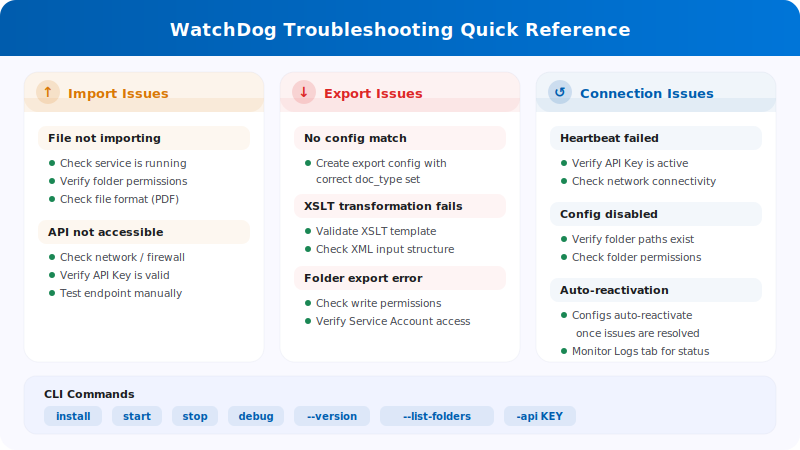

# WatchDog Admin FAQ & Troubleshooting

<figure><figcaption></figcaption></figure>

This documentation helps administrators understand WatchDog error messages and troubleshoot issues.

**UI Location:** Settings → Document Processing → WatchDog

---

## 1. WatchDog Settings Pages (UI)

### 1.1 General Tab

* **Download:** Get the latest WatchDog.exe
* **API Key:** Copy the configuration command
* **Auto-Update Schedule:** Configure update frequency
* **Installation Guide:** Step-by-step setup instructions

### 1.2 Configurations Tab

* **Import Configurations:** Define watch folders and document types
* **Export Configurations:** Define export destinations and methods
* **Bulk Copy:** Copy configurations across sub-organisations
* **Import/Export:** Import/export configs as JSON

> **Important:** Export configurations now **require a document type** (`doc_type`). Configurations without a valid document type will be rejected.

### 1.3 Status Tab

* Shows real-time WatchDog connection status
* **New fields:** `last_restart`, `version_first_seen`, `latest_version_checked_at`
* **System info:** Installation path, free RAM, free disk space

### 1.4 Logs Tab

* Shows all WatchDog events from OpenSearch
* Filterable by event type, time period, etc.
* **Event Types:**
  * `FILE_IMPORT_STARTED`: File import started
  * `FILE_IMPORT_COMPLETED`: Import successful
  * `FILE_IMPORT_FAILED`: Import failed
  * `EXPORT_STARTED`: Export started
  * `EXPORT_COMPLETED`: Export successful
  * `EXPORT_FAILED`: Export failed
  * `FOLDER_VALIDATION_FAILED`: Folder not reachable
  * `CONFIG_LOADED`: Configuration loaded
  * `SERVICE_RESTART_INITIATED`: Service restart requested
  * `SERVICE_RESTART_COMPLETED`: Service restarted

### 1.5 XSLT Templates Tab

* Upload and manage XSLT transformation templates
* Live validation with field analysis
* Link templates to export configurations

---

## 2. Folder Validation Error Messages

| Error | Meaning | Solution |
| :--- | :--- | :--- |
| `not_found` | Folder does not exist | Create folder or correct path |
| `no_read_access` | No read permission | Set permissions for WatchDog Service Account |
| `no_write_access` | No write permission | Grant write rights to Service Account |
| `not_configured` | Folder path not configured | Enter path in configuration |

**Affected Folders:**

* **Watch Folder (Import):** Where WatchDog looks for new files
* **Success Folder:** Where successfully imported files are moved
* **Export Folder:** Where exported XML/PDF files are written

---

## 3. Import Error Messages

| Error | Meaning | Solution |
| :--- | :--- | :--- |
| `file_not_found` | File was deleted before import | Provide file again |
| `invalid_file_type` | Only PDF files are supported | Remove other file types |
| `api_not_accessible` | DocBits API not reachable | Check network/firewall, verify API URL |
| `api_check_failed` | API Health Check failed | Check API Key and connection |
| `upload_failed` | Upload to API failed | Check API Key, network, server status |

---

## 4. Export Error Messages

| Error | Meaning | Solution |
| :--- | :--- | :--- |
| `transformation_error` | XSLT Transformation failed | Check XSLT Template, validate XML structure |
| `folder_error` | Export folder not reachable | Create folder, check permissions |
| `file_write_error` | File could not be written | Check disk space, permissions, file locks |
| `permission_denied` | No write permission | Set Service Account permissions |
| `creation_failed` | Folder could not be created | Check parent folder permissions |
| `no_config_match` | No matching export configuration | Create export config with correct document type |

> **Note:** Export configurations require a `doc_type`. If you see `no_config_match`, verify that an active export configuration exists for the document's type.

---

## 5. Configuration Disabled — Reasons

When a configuration is disabled, one of these reasons appears:

| Disabled Reason | Meaning |
| :--- | :--- |
| `Watch folder: not_found` | Import folder does not exist |
| `Watch folder: no_read_access` | Import folder not readable |
| `Export folder: not_found` | Export folder does not exist |
| `Export folder: no_write_access` | Export folder not writable |
| `Success folder: not_found` | Success folder does not exist |
| `Success folder: no_write_access` | Success folder not writable |

**Automatic Reactivation:** WatchDog checks folders regularly (every 60 seconds). As soon as the folder is reachable again, the configuration is automatically reactivated.

---

## 6. Error Folder (`_error`)

Failed files are moved to the `_error` folder:

**Location:** `{import_folder}/_error/{error_type}/`

**File Format:** `{original_name}_{YYYYMMDD_HHMMSS}.pdf`

**Sidecar File:** Each failed file has a `.error` companion file with:

```
Error Type: transformation_error
Error Message: XSLT template not found
Timestamp: 2026-03-26 08:30:15
Original File: invoice_001.pdf
Original Path: C:\WatchDog\Import\invoice_001.pdf
```

---

## 7. Heartbeat & Connection Status

WatchDog sends a heartbeat to DocBits every ~10 seconds with system information:

| Data Sent | Description |
| :--- | :--- |
| Timestamp | Current time |
| Version | Installed WatchDog version |
| Last Restart | Last service restart time |
| Auto-Update Enabled | Whether auto-update is active |
| Latest Version | Newest available version |
| Installation Path | Where WatchDog is installed |
| Free RAM / Disk | Available system resources |

### Connection Status

| Status | Meaning |
| :--- | :--- |
| ✅ **Online** | WatchDog is connected and active |
| ⚠️ **Offline** | No heartbeat for 30+ seconds |
| ❌ **Not Installed** | WatchDog has never connected |

**Heartbeat Errors:**

* `Heartbeat failed - invalid API key` → API Key is invalid
* `Heartbeat failed: 401` → Authentication failed
* `Heartbeat failed: 5xx` → Server problem

---

## 8. Common Problems & Solutions

### Problem: WatchDog does not import files

1. Check if service is running: `services.msc` → WatchDog
2. Check logs: Settings → WatchDog → Logs Tab
3. Check folder permissions for WatchDog Service Account
4. Test API connection: `WatchDog.exe debug` in CMD
5. Verify file type is PDF

### Problem: Export does not work

1. Export configuration exists with correct document type?
2. Document type matches between document and config?
3. XSLT Template linked (for folder export)?
4. Export folder writable by Service Account?
5. For Infor exports: ION credentials configured correctly?

### Problem: Configuration is disabled

1. Folder path exists?
2. Permissions for `NT AUTHORITY\LOCAL SERVICE` or Service Account?
3. Network drive reachable? (Check UNC paths)
4. WatchDog will auto-reactivate when folders become available again

### Problem: XSLT Transformation fails

1. XSLT Template is valid? (use XSLT Templates Tab → Validate)
2. Template fits document type?
3. Check XML structure of the document
4. V3 Folder Export uses server-side transformation — check API connectivity

### Problem: REST API Export fails

1. ION OAuth credentials configured in export configuration?
2. Target API endpoint reachable from WatchDog server?
3. Check payload format matches target API expectations
4. Review request chain configuration for JSONPath errors

---

## 9. Command Line Commands

```bash
# Configure API connection
WatchDog.exe -api YOUR_API_KEY

# Install Service
WatchDog.exe install

# Start Service
WatchDog.exe start

# Stop Service
WatchDog.exe stop

# Run in debug mode (console output)
WatchDog.exe debug

# Uninstall Service
WatchDog.exe remove

# Show version
WatchDog.exe --version

# List watch folders
WatchDog.exe --list-folders

# Add/remove watch folder
WatchDog.exe --add-folder "C:\Import\Invoices"
WatchDog.exe --remove-folder "C:\Import\Invoices"

# Check Windows service status
sc query WatchDog
```

---

## 10. Log Files

**Location:** `C:\WatchDog\logs\{module}\`

**Log Format:**
```
INFO  - 2026-03-26 10:00:00 - module_name - Message - function=func_name - line=42
```

**Log Level:** DEBUG, INFO, WARNING, ERROR

**Remote Logs:** WatchDog also sends logs to DocBits (viewable in Logs Tab) and optionally to Logtail cloud logging.
