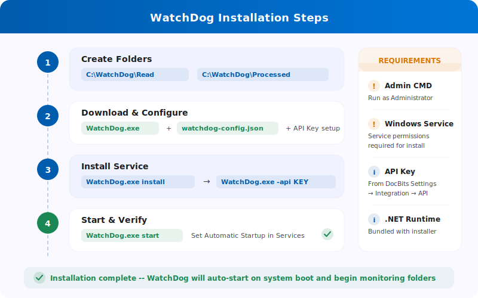

# WatchDog Installation

<figure><figcaption></figcaption></figure>

> **Recommended:** Use the modern setup described below. WatchDog configurations are now created directly in the DocBits application — no local config files needed.

## Prerequisites

* Windows Server or Windows 10/11
* Administrator access
* Network connectivity to DocBits API
* DocBits API Key (available in Settings → WatchDog → General Tab)

## Installation Steps

### 1. Create Required Folders

Create a main directory and subfolders for WatchDog:

```
C:\WatchDog\              ← WatchDog executable
C:\WatchDog\Import\       ← Watch folder for incoming documents
C:\WatchDog\Processed\    ← Success folder for processed documents
C:\WatchDog\Export\        ← Export folder for exported files
```

> **Note:** It is recommended to use local paths. UNC network paths (e.g. `\\server\share`) are supported but may require a Polling Observer for reliable file detection.

### 2. Download WatchDog

Download `WatchDog.exe` from the DocBits application:

**Settings → Document Processing → WatchDog → General Tab → Download**

Place the downloaded `WatchDog.exe` file in `C:\WatchDog\`.

### 3. Configure API Connection

Open **Command Prompt (CMD)** as **Administrator** and run:

```powershell
cd C:\WatchDog
WatchDog.exe -api YOUR_API_KEY
```

This connects WatchDog to your DocBits organisation and fetches configurations automatically.

### 4. Install as Windows Service

```powershell
WatchDog.exe install
```

### 5. Start the Service

```powershell
WatchDog.exe start
```

### 6. Create Configurations in DocBits

Navigate to **Settings → Document Processing → WatchDog → Configurations Tab** in DocBits:

* Click **New Import Configuration** to set up watch folders
* Click **New Export Configuration** to set up export destinations

> **Important:** Export configurations require a **document type**. All configurations are managed centrally in DocBits, not in local config files.

### 7. Set Automatic Startup

1. Open **Services** (`Win + R` → `services.msc`)
2. Find **WatchDog** in the service list
3. Double-click to open properties
4. Set **Startup Type** to **Automatic (Delayed Start)**
5. Click **OK**

## Verify Installation

After installation, check the WatchDog status in DocBits:

**Settings → WatchDog → Status Tab**

* ✅ **Online** — WatchDog is connected and sending heartbeats
* Version, last restart, and system information should be visible

## Command Reference

| Command | Description |
| :--- | :--- |
| `WatchDog.exe -api KEY` | Configure API Key |
| `WatchDog.exe install` | Install as Windows Service |
| `WatchDog.exe start` | Start the service |
| `WatchDog.exe stop` | Stop the service |
| `WatchDog.exe debug` | Run in console mode (for troubleshooting) |
| `WatchDog.exe remove` | Uninstall the service |
| `WatchDog.exe --version` | Show current version |
| `WatchDog.exe --list-folders` | List configured watch folders |
| `WatchDog.exe --add-folder PATH` | Add a watch folder |
| `WatchDog.exe --remove-folder PATH` | Remove a watch folder |

---

## Legacy: V1 Configuration (Deprecated)

The following V1 setup method using local config files is **deprecated**. Use the modern API-based setup above instead.

<details>
<summary>V1 Setup (click to expand)</summary>

### Configuring WatchDog in DocBits (V1)

1. **Access WatchDog Settings**
   * Navigate to **Settings → Document Processing → WatchDog**
2. **Folder Settings**
   * Define the paths: `C:/WatchDog/Read` and `C:/WatchDog/Processed`

   <figure><figcaption></figcaption></figure>

3. **General Settings**
   * Select document types, configure export destination

   <figure><figcaption></figcaption></figure>

4. **Export Configurations**
   * Shows configured exports for on-premise processing

   <figure><figcaption></figcaption></figure>

5. **Download Configuration**
   * Download `watchdog-config.json` and place in `C:\WatchDog\`

   <figure><figcaption></figcaption></figure>

</details>
