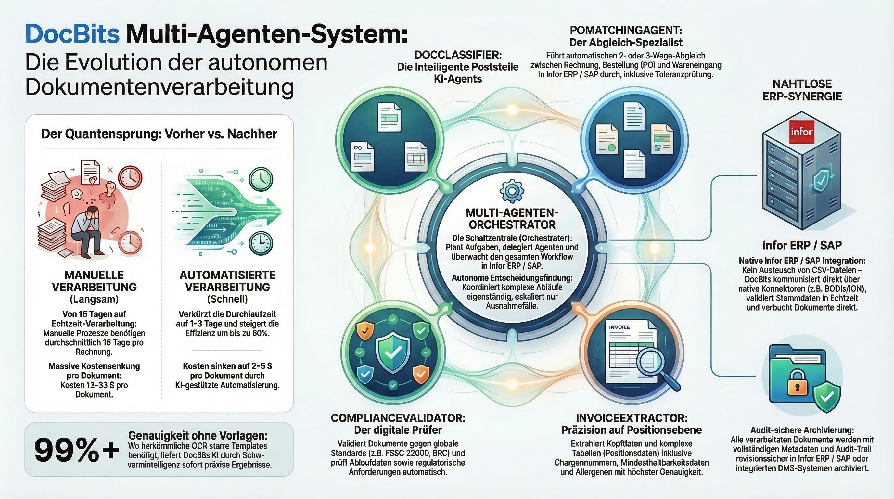

# DocNet – Intelligente Dokumentenverarbeitung mit KI-Agenten

<figure><figcaption>
DocBits Multi-Agent-System für autonome Dokumentenverarbeitung
</figcaption></figure>

## Was ist DocNet?

DocNet ist die KI-gesteuerte Automatisierungsplattform im DocBits-Ökosystem. Sie ermöglicht es Benutzern, ihre Dokumentenverarbeitung durch natürliche Sprache zu steuern und sie mit intelligenten Agenten zu automatisieren — ohne technische Expertise erforderlich.

## Hauptvorteile

### 1. Dokumentenkontrolle in natürlicher Sprache

Benutzer stellen Fragen in alltäglicher Sprache und erhalten sofortige Antworten:

- *"Wie viele Rechnungen warten auf Freigabe?"*
- *"Was ist der Status von Rechnung 1001?"*
- *"Zeige mir alle offenen Bestellungen."*
- *"Lade meine Dokumente hoch."*

**Vorteil:** Keine Navigation durch komplexe Menüs. Ein einziges Chat-Fenster ersetzt dutzende Klicks.

### 2. KI-Agenten automatisieren Routineaufgaben

DocNet bietet vorkonfigurierte Systemagenten, die sofort einsatzbereit sind:

| Agent | Was er tut | Wann er aktiviert wird |
|-------|-----------|------------------------|
| **DocBits Guide** | Beantwortet Fragen zur Verwendung von DocBits | Bei Hilfeanfragen im Chat |
| **Invoice Validation** | Prüft Rechnungsfelder automatisch auf Vollständigkeit | Beim Hochladen oder Statusänderung |
| **Document Classification** | Identifiziert automatisch den Dokumenttyp | Bei unbekannten Dokumenten |
| **PO Match Assistant** | Unterstützt bei der Bestellabstimmung | Bei Abgleichsanfragen |

**Vorteil:** Wiederkehrende Kontrollen und Zuweisungen laufen automatisch — Mitarbeiter können sich auf Ausnahmefälle konzentrieren.

### 3. Benutzerdefinierte Agenten erstellen

Organisationen können ihre eigenen Agenten konfigurieren:

- **Auslöser definieren:** Dokumentenhochladung, Statusänderung, Zeitplan, Chat-Befehl oder manuell
- **Fähigkeiten zuweisen:** Extraktion, Klassifizierung, Validierung, Stammdatenabfrage, Bestellabgleich, Übersetzung, Zusammenfassung
- **Vorlagen verwenden:** Schneller Start mit bewährten Agentenvorlagen

**Vorteil:** Jede Organisation passt die Automatisierung an ihre eigenen Prozesse an.

### 4. Multi-Channel-Zugriff

DocNet ist überall erreichbar:

- **Web-Chat** direkt in DocBits
- **Slack**-Integration
- **Microsoft Teams**-Integration
- **Discord**-Integration
- **E-Mail**-Verarbeitung

**Vorteil:** Mitarbeiter nutzen ihre vertrauten Kommunikationstools.

### 5. Multi-Agent-Orchestrator

Der Multi-Agent-Orchestrator koordiniert mehrere Agenten für komplexe Aufgaben:

1. Eingehende Anfrage (z. B. E-Mail mit Rechnungsanhang)
2. Automatische Planung: Welche Agenten werden benötigt?
3. Ausführung in der richtigen Reihenfolge
4. Ergebniszusammenfassung und Benachrichtigung

**Vorteil:** Komplexe Workflows, die zuvor manuelle Koordination erforderten, laufen vollständig automatisch.

### 6. MCP-Integration für externe KI-Tools

DocNet unterstützt das Model Context Protocol (MCP), das es externen KI-Assistenten (wie Claude Desktop oder anderen Tools) ermöglicht, direkt mit DocBits zu arbeiten:

- Dokumente hochladen und verarbeiten
- Status abfragen und auf Abschluss warten
- Felder extrahieren und aktualisieren
- Dokumente validieren und exportieren (z. B. zu Infor ERP / SAP)

**Vorteil:** KI-Assistenten werden zu vollwertigen DocBits-Benutzern — ideal für Power-User und Entwickler.

## Typische Anwendungsfälle

### Rechnungsverarbeitung
1. Rechnung per E-Mail eingegangen
2. Dokumentenklassifizierung identifiziert: *Rechnung*
3. Extraktion liest Felder (Rechnungsnummer, Betrag, Lieferant)
4. Validierung überprüft Vollständigkeit
5. Bestellabgleich ordnet die Rechnung der Bestellung zu
6. Bei Erfolg: automatischer Export zu Infor ERP / SAP

### Lieferantenabfragen über Chat
- Mitarbeiter fragt: *"Welche Rechnungen vom Lieferanten XY sind offen?"*
- DocNet durchsucht die Datenbank und liefert eine strukturierte Antwort
- Mitarbeiter kann Maßnahmen direkt auslösen: *"Genehmige Rechnung 1001."*

### Automatische Qualitätskontrolle
- Agent prüft jede hochgeladene Rechnung auf erforderliche Felder
- Bei fehlenden Daten: automatische Benachrichtigung an den zuständigen Mitarbeiter
- Dashboard zeigt Übersicht über alle offenen Validierungsfehler

## Vorher-Nachher-Vergleich

| Bereich | Ohne DocNet | Mit DocNet |
|---------|-------------|-----------|
| Dokumentenstatus | Manuell im System prüfen | Per Chat abfragen |
| Rechnungsprüfung | Jede Rechnung einzeln prüfen | Automatische Validierung |
| Dokumenttyp | Manuell zuweisen | Automatische Klassifizierung |
| Bestellabgleich | Manuelle Abstimmung | KI-gestützter Abgleich |
| Kommunikation | Nur Web-UI | Chat, Slack, Teams, E-Mail |
| Komplexe Workflows | Manuelle Koordination | Orchestrator automatisiert |
| Externe Tools | Nicht möglich | MCP-Integration |
