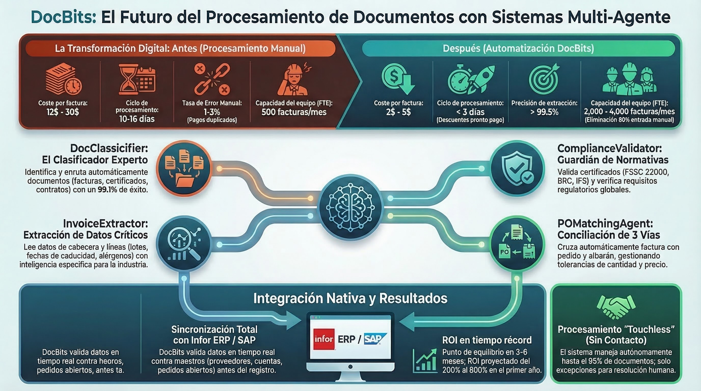

# DocNet – Procesamiento Inteligente de Documentos con Agentes de IA

<figure><figcaption>
Sistema Multi-Agente de DocBits para Procesamiento Autónomo de Documentos
</figcaption></figure>

## ¿Qué es DocNet?

DocNet es la plataforma de automatización impulsada por IA dentro del ecosistema de DocBits. Permite a los usuarios controlar su procesamiento de documentos a través del lenguaje natural y automatizarlo con agentes inteligentes — sin necesidad de experiencia técnica.

## Beneficios Principales

### 1. Control de Documentos en Lenguaje Natural

Los usuarios hacen preguntas en lenguaje cotidiano y obtienen respuestas instantáneas:

- *"¿Cuántas facturas están esperando aprobación?"*
- *"¿Cuál es el estado de la factura 1001?"*
- *"Muestrame todas las órdenes de compra abiertas."*
- *"Sube mis documentos."*

**Beneficio:** Sin navegar por menús complejos. Una sola ventana de chat reemplaza docenas de clics.

### 2. Agentes de IA Automatizan Tareas Rutinarias

DocNet proporciona agentes del sistema preconfigurados que están listos para usar inmediatamente:

| Agente | Qué hace | Cuándo se activa |
|--------|----------|------------------|
| **Guía de DocBits** | Responde preguntas sobre cómo usar DocBits | En solicitudes de ayuda en el chat |
| **Validación de Facturas** | Verifica automáticamente los campos de la factura por completitud | En carga o cambio de estado |
| **Clasificación de Documentos** | Identifica automáticamente el tipo de documento | Para documentos desconocidos |
| **Asistente de Coincidencia de Órdenes de Compra** | Asiste con la coincidencia de órdenes de compra | En solicitudes de coincidencia |

**Beneficio:** Las comprobaciones recurrentes y asignaciones se ejecutan automáticamente — los empleados pueden enfocarse en excepciones.

### 3. Crear Agentes Personalizados

Las organizaciones pueden configurar sus propios agentes:

- **Definir desencadenantes:** Carga de documento, cambio de estado, programación, comando de chat o manual
- **Asignar capacidades:** Extracción, clasificación, validación, búsqueda de datos maestros, coincidencia de órdenes de compra, traducción, resumen
- **Usar plantillas:** Inicio rápido con plantillas de agente comprobadas

**Beneficio:** Cada organización adapta la automatización a sus propios procesos.

### 4. Acceso Multi-Canal

DocNet es accesible en todas partes:

- **Chat Web** directamente en DocBits
- Integración con **Slack**
- Integración con **Microsoft Teams**
- Integración con **Discord**
- Procesamiento de **Email**

**Beneficio:** Los empleados utilizan sus herramientas de comunicación familiares.

### 5. Orquestador Multi-Agente

El Orquestador Multi-Agente coordina múltiples agentes para tareas complejas:

1. Solicitud entrante (p. ej., correo electrónico con archivo adjunto de factura)
2. Planificación automática: ¿Qué agentes se necesitan?
3. Ejecución en el orden correcto
4. Resumen de resultados y notificación

**Beneficio:** Flujos de trabajo complejos que anteriormente requerían coordinación manual se ejecutan completamente de forma automática.

### 6. Integración de MCP para Herramientas de IA Externas

DocNet admite el Protocolo de Contexto del Modelo (MCP), permitiendo que asistentes de IA externos (como Claude Desktop u otras herramientas) trabajen directamente con DocBits:

- Cargar y procesar documentos
- Consultar estado y esperar finalización
- Extraer y actualizar campos
- Validar y exportar documentos (p. ej., a Infor ERP / SAP)

**Beneficio:** Los asistentes de IA se convierten en usuarios completos de DocBits — ideal para usuarios avanzados y desarrolladores.

## Casos de Uso Típicos

### Procesamiento de Facturas
1. Factura recibida por correo electrónico
2. La clasificación de documentos identifica: *Factura*
3. La extracción lee los campos (número de factura, cantidad, proveedor)
4. La validación verifica la completitud
5. La coincidencia de órdenes de compra asigna la factura a la orden de compra
6. En caso de éxito: exportación automática a Infor ERP / SAP

### Consultas de Proveedores a través del Chat
- El empleado pregunta: *"¿Qué facturas del proveedor XY están abiertas?"*
- DocNet busca en la base de datos y entrega una respuesta estructurada
- El empleado puede desencadenar acciones directamente: *"Aprobar factura 1001."*

### Control de Calidad Automático
- El agente verifica cada factura cargada en busca de campos obligatorios
- En caso de datos faltantes: notificación automática al empleado responsable
- El panel de control muestra una descripción general de todos los errores de validación abiertos

## Comparación Antes y Después

| Área | Sin DocNet | Con DocNet |
|------|-----------|-----------|
| Estado del documento | Verificar manualmente en el sistema | Preguntar a través del chat |
| Verificación de facturas | Verificar cada factura individualmente | Validación automática |
| Tipo de documento | Asignar manualmente | Clasificación automática |
| Coincidencia de órdenes de compra | Reconciliación manual | Coincidencia impulsada por IA |
| Comunicación | Solo interfaz web | Chat, Slack, Teams, Email |
| Flujos de trabajo complejos | Coordinación manual | Orquestador automatiza |
| Herramientas externas | No es posible | Integración de MCP |
