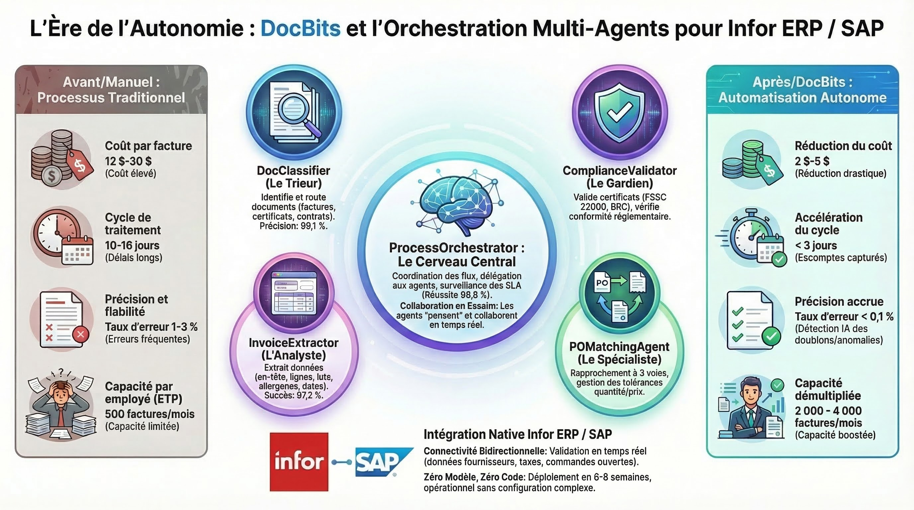

# DocNet – Traitement Intelligent des Documents avec des Agents IA

<figure><figcaption>
Système Multi-Agent DocBits pour le Traitement Autonome des Documents
</figcaption></figure>

## Qu'est-ce que DocNet ?

DocNet est la plateforme d'automatisation basée sur l'IA au sein de l'écosystème DocBits. Elle permet aux utilisateurs de contrôler leur traitement des documents via le langage naturel et de l'automatiser avec des agents intelligents — aucune expertise technique requise.

## Avantages Clés

### 1. Contrôle des Documents en Langage Naturel

Les utilisateurs posent des questions en langage courant et obtiennent des réponses instantanées :

- *« Combien de factures attendent une approbation ? »*
- *« Quel est le statut de la facture 1001 ? »*
- *« Affiche-moi tous les bons de commande ouverts. »*
- *« Télécharger mes documents. »*

**Avantage :** Pas de navigation dans des menus complexes. Une seule fenêtre de chat remplace des dizaines de clics.

### 2. Les Agents IA Automatisent les Tâches Routinières

DocNet fournit des agents système pré-configurés qui sont prêts à l'emploi immédiatement :

| Agent | Fonction | Quand il s'active |
|-------|----------|-------------------|
| **Guide DocBits** | Répond aux questions sur l'utilisation de DocBits | Sur demandes d'aide dans le chat |
| **Validation de Factures** | Vérifie automatiquement les champs de facture pour la complétude | À l'upload ou changement de statut |
| **Classification de Documents** | Identifie automatiquement le type de document | Pour les documents inconnus |
| **Assistant d'Appairage PO** | Aide à l'appairage des bons de commande | Sur demandes d'appairage |

**Avantage :** Les vérifications récurrentes et les assignations s'exécutent automatiquement — les employés peuvent se concentrer sur les exceptions.

### 3. Créer des Agents Personnalisés

Les organisations peuvent configurer leurs propres agents :

- **Définir les déclencheurs :** Upload de document, changement de statut, planification, commande chat, ou manuel
- **Assigner les capacités :** Extraction, classification, validation, recherche de données maître, appairage PO, traduction, résumé
- **Utiliser des modèles :** Démarrer rapidement avec des modèles d'agents éprouvés

**Avantage :** Chaque organisation adapte l'automatisation à ses propres processus.

### 4. Accès Multi-Canal

DocNet est accessible partout :

- **Web Chat** directement dans DocBits
- Intégration **Slack**
- Intégration **Microsoft Teams**
- Intégration **Discord**
- Traitement **Email**

**Avantage :** Les employés utilisent leurs outils de communication familiers.

### 5. Orchestrateur Multi-Agent

L'Orchestrateur Multi-Agent coordonne plusieurs agents pour les tâches complexes :

1. Demande entrante (par exemple, email avec pièce jointe facture)
2. Planification automatique : Quels agents sont nécessaires ?
3. Exécution dans le bon ordre
4. Résumé des résultats et notification

**Avantage :** Les flux de travail complexes qui nécessitaient auparavant une coordination manuelle s'exécutent entièrement automatiquement.

### 6. Intégration MCP pour les Outils IA Externes

DocNet supporte le Model Context Protocol (MCP), permettant aux assistants IA externes (tels que Claude Desktop ou d'autres outils) de travailler directement avec DocBits :

- Télécharger et traiter les documents
- Interroger le statut et attendre la fin de traitement
- Extraire et mettre à jour les champs
- Valider et exporter les documents (par exemple, vers Infor ERP / SAP)

**Avantage :** Les assistants IA deviennent des utilisateurs DocBits à part entière — idéal pour les utilisateurs avancés et les développeurs.

## Cas d'Usage Typiques

### Traitement de Factures
1. Facture reçue par email
2. Classification automatique des documents : *Facture*
3. Extraction des champs (numéro de facture, montant, fournisseur)
4. Validation de la complétude
5. Appairage PO assigne la facture au bon de commande
6. En cas de succès : export automatique vers Infor ERP / SAP

### Demandes de Fournisseurs via Chat
- L'employé demande : *« Quelles factures du fournisseur XY sont ouvertes ? »*
- DocNet recherche dans la base de données et fournit une réponse structurée
- L'employé peut déclencher des actions directement : *« Approuver la facture 1001. »*

### Contrôle de Qualité Automatique
- L'agent vérifie chaque facture téléchargée pour les champs obligatoires
- En cas de données manquantes : notification automatique à l'employé responsable
- Le tableau de bord affiche un aperçu de toutes les erreurs de validation en attente

## Comparaison Avant et Après

| Domaine | Sans DocNet | Avec DocNet |
|---------|------------|-------------|
| Statut du document | Vérifier manuellement dans le système | Demander via chat |
| Vérification de factures | Vérifier chaque facture individuellement | Validation automatique |
| Type de document | Assigner manuellement | Classification automatique |
| Appairage PO | Réconciliation manuelle | Appairage basé sur l'IA |
| Communication | Interface Web seulement | Chat, Slack, Teams, Email |
| Flux de travail complexes | Coordination manuelle | Orchestrateur automatisé |
| Outils externes | Non disponible | Intégration MCP |
