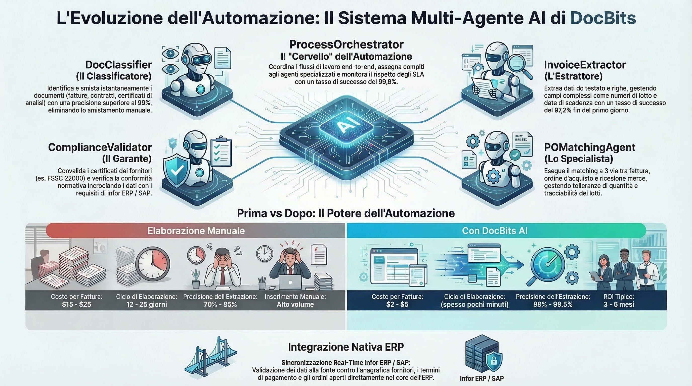

# DocNet – Elaborazione Intelligente dei Documenti con Agenti AI

<figure><figcaption>
Sistema Multi-Agent di DocBits per l'Elaborazione Autonoma dei Documenti
</figcaption></figure>

## Che cos'è DocNet?

DocNet è la piattaforma di automazione alimentata da intelligenza artificiale all'interno dell'ecosistema DocBits. Consente agli utenti di controllare l'elaborazione dei loro documenti attraverso il linguaggio naturale e automatizzarla con agenti intelligenti — senza richiedere competenze tecniche.

## Vantaggi Principali

### 1. Controllo Naturale dei Documenti tramite Linguaggio

Gli utenti pongono domande in linguaggio quotidiano e ricevono risposte istantanee:

- *"Quante fatture sono in attesa di approvazione?"*
- *"Qual è lo stato della fattura 1001?"*
- *"Mostrami tutti gli ordini di acquisto aperti."*
- *"Carica i miei documenti."*

**Vantaggio:** Nessuna necessità di navigare in menu complessi. Una singola finestra di chat sostituisce dozzine di clic.

### 2. Agenti AI Automatizzano le Attività Ricorrenti

DocNet fornisce agenti di sistema pre-configurati pronti all'uso immediato:

| Agente | Cosa fa | Quando si attiva |
|--------|---------|------------------|
| **Guida DocBits** | Risponde alle domande sull'utilizzo di DocBits | Su richieste di aiuto nella chat |
| **Validazione Fatture** | Verifica automaticamente i campi della fattura per completezza | Al caricamento o al cambio di stato |
| **Classificazione Documenti** | Identifica automaticamente il tipo di documento | Per documenti sconosciuti |
| **Assistente PO Match** | Assiste nell'abbinamento degli ordini di acquisto | Su richieste di abbinamento |

**Vantaggio:** I controlli ricorrenti e le assegnazioni vengono eseguiti automaticamente — i dipendenti possono concentrarsi sulle eccezioni.

### 3. Creare Agenti Personalizzati

Le organizzazioni possono configurare i propri agenti:

- **Definisci i trigger:** Caricamento documento, cambio di stato, pianificazione, comando chat o manuale
- **Assegna capacità:** Estrazione, classificazione, validazione, ricerca dati master, abbinamento PO, traduzione, riepilogo
- **Usa modelli:** Inizia rapidamente con modelli di agenti collaudati

**Vantaggio:** Ogni organizzazione personalizza l'automazione in base ai propri processi.

### 4. Accesso Multi-Canale

DocNet è accessibile ovunque:

- **Chat Web** direttamente in DocBits
- Integrazione **Slack**
- Integrazione **Microsoft Teams**
- Integrazione **Discord**
- Elaborazione **Email**

**Vantaggio:** I dipendenti utilizzano i loro strumenti di comunicazione familiari.

### 5. Orchestratore Multi-Agent

L'Orchestratore Multi-Agent coordina più agenti per attività complesse:

1. Richiesta in arrivo (ad esempio, email con allegato fattura)
2. Pianificazione automatica: Quali agenti sono necessari?
3. Esecuzione nell'ordine corretto
4. Riepilogo del risultato e notifica

**Vantaggio:** I flussi di lavoro complessi che in precedenza richiedevano coordinamento manuale vengono eseguiti completamente in modo automatico.

### 6. Integrazione MCP per Strumenti AI Esterni

DocNet supporta il Model Context Protocol (MCP), consentendo agli assistenti AI esterni (come Claude Desktop o altri strumenti) di lavorare direttamente con DocBits:

- Caricare ed elaborare documenti
- Interrogare lo stato e attendere il completamento
- Estrarre e aggiornare campi
- Convalidare ed esportare documenti (ad esempio, in Infor ERP / SAP)

**Vantaggio:** Gli assistenti AI diventano utenti completi di DocBits — ideale per utenti esperti e sviluppatori.

## Casi d'Uso Tipici

### Elaborazione Fatture
1. Fattura ricevuta via email
2. La classificazione dei documenti identifica: *Fattura*
3. L'estrazione legge i campi (numero fattura, importo, fornitore)
4. La validazione verifica la completezza
5. L'abbinamento PO assegna la fattura all'ordine di acquisto
6. In caso di successo: esportazione automatica in Infor ERP / SAP

### Richieste di Fornitori tramite Chat
- Il dipendente chiede: *"Quali fatture del fornitore XY sono aperte?"*
- DocNet cerca nel database e fornisce una risposta strutturata
- Il dipendente può attivare azioni direttamente: *"Approva la fattura 1001."*

### Controllo di Qualità Automatico
- L'agente verifica ogni fattura caricata per i campi obbligatori
- In caso di dati mancanti: notifica automatica al dipendente responsabile
- Il dashboard mostra una panoramica di tutti gli errori di validazione aperti

## Confronto Prima e Dopo

| Area | Senza DocNet | Con DocNet |
|------|--------------|-----------|
| Stato del documento | Controllare manualmente nel sistema | Chiedere tramite chat |
| Verifica fattura | Controllare singolarmente ogni fattura | Validazione automatica |
| Tipo di documento | Assegnare manualmente | Classificazione automatica |
| Abbinamento PO | Riconciliazione manuale | Abbinamento potenziato da AI |
| Comunicazione | Solo interfaccia Web | Chat, Slack, Teams, Email |
| Flussi di lavoro complessi | Coordinamento manuale | L'Orchestratore automatizza |
| Strumenti esterni | Non possibile | Integrazione MCP |
