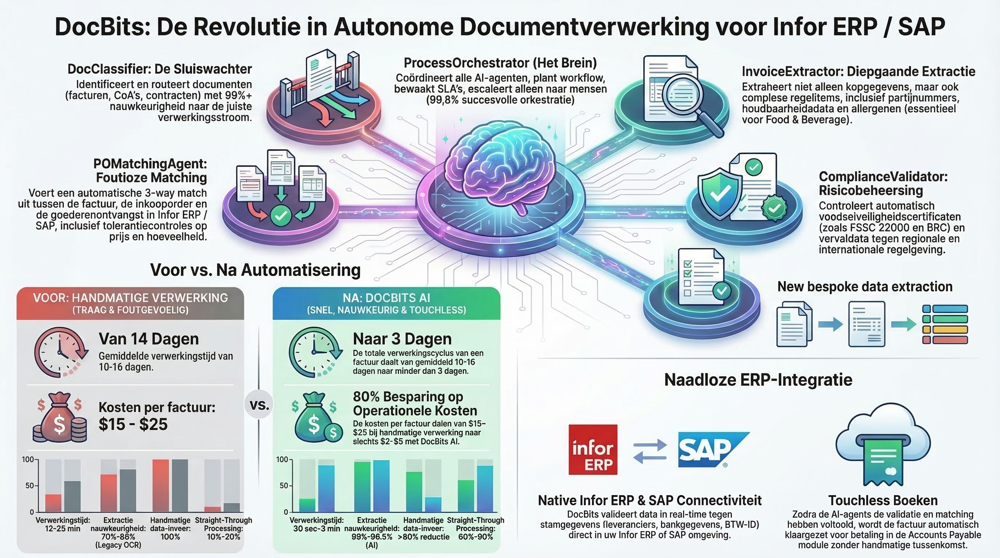

# DocNet – Intelligente documentverwerking met AI-agenten

<figure><figcaption>
DocBits Multi-Agent System voor autonome documentverwerking
</figcaption></figure>

## Wat is DocNet?

DocNet is het op AI gebaseerde automatiseringsplatform binnen het DocBits-ecosysteem. Het stelt gebruikers in staat hun documentverwerking met natuurlijke taal te beheren en dit te automatiseren met intelligente agenten — zonder technische expertise nodig.

## Kernvoordelen

### 1. Documentbeheer in natuurlijke taal

Gebruikers stellen vragen in alledaagse taal en krijgen onmiddellijk antwoorden:

- *"Hoeveel facturen wachten op goedkeuring?"*
- *"Wat is de status van factuur 1001?"*
- *"Toon mij alle openstaande inkooporders."*
- *"Upload mijn documenten."*

**Voordeel:** Geen navigatie door complexe menu's. Een enkel chatvenster vervangt tientallen klikken.

### 2. AI-agenten automatiseren routinetaken

DocNet biedt vooraf geconfigureerde systeemагenten die onmiddellijk klaar zijn voor gebruik:

| Agent | Wat het doet | Wanneer het activeert |
|-------|-------------|----------------------|
| **DocBits Guide** | Beantwoordt vragen over het gebruik van DocBits | Bij hulpvragen in chat |
| **Invoice Validation** | Controleert automatisch factuurvelden op volledigheid | Bij upload of statusverandering |
| **Document Classification** | Identificeert automatisch documenttype | Voor onbekende documenten |
| **PO Match Assistant** | Helpt met afstemming van inkooporders | Bij aanvragen voor afstemming |

**Voordeel:** Terugkerende controles en toewijzingen draaien automatisch — werknemers kunnen zich op uitzonderingen richten.

### 3. Aangepaste agenten maken

Organisaties kunnen hun eigen agenten configureren:

- **Triggers definiëren:** Documentupload, statusverandering, planning, chatomdracht of handmatig
- **Mogelijkheden toewijzen:** Extractie, classificatie, validatie, mastergegevens opzoeken, PO-afstemming, vertaling, samenvatting
- **Sjablonen gebruiken:** Snel starten met bewezen agentsjablonen

**Voordeel:** Elke organisatie past automatisering aan haar eigen processen aan.

### 4. Multi-Channel Toegang

DocNet is overal toegankelijk:

- **Web Chat** rechtstreeks in DocBits
- **Slack** integratie
- **Microsoft Teams** integratie
- **Discord** integratie
- **E-mail** verwerking

**Voordeel:** Werknemers gebruiken hun bekende communicatietools.

### 5. Multi-Agent Orchestrator

De Multi-Agent Orchestrator coördineert meerdere agenten voor complexe taken:

1. Inkomend verzoek (bijvoorbeeld e-mail met factuurbijlage)
2. Automatische planning: Welke agenten zijn nodig?
3. Uitvoering in de juiste volgorde
4. Samenvattingen resultaten en melding

**Voordeel:** Complexe workflows die voorheen handmatige coördinatie vereisten, draaien volledig automatisch.

### 6. MCP Integratie voor externe AI-tools

DocNet ondersteunt het Model Context Protocol (MCP), waardoor externe AI-assistenten (zoals Claude Desktop of andere tools) rechtstreeks met DocBits kunnen werken:

- Upload en verwerk documenten
- Query status en wacht op voltooiing
- Extraheer en update velden
- Valideer en exporteer documenten (bijvoorbeeld naar Infor ERP / SAP)

**Voordeel:** AI-assistenten worden volledige DocBits-gebruikers — ideaal voor ervaren gebruikers en ontwikkelaars.

## Typische gebruiksscenario's

### Factuurverwerking
1. Factuur ontvangen via e-mail
2. Documentclassificatie identificeert: *Factuur*
3. Extractie leest velden (factuurnummer, bedrag, leverancier)
4. Validatie controleert volledigheid
5. PO-afstemming wijst de factuur toe aan de inkooporder
6. Bij succes: automatische export naar Infor ERP / SAP

### Leveranciersvragen via chat
- Werknemer vraagt: *"Welke facturen van leverancier XY staan open?"*
- DocNet doorzoekt de database en levert een gestructureerd antwoord
- Werknemer kan acties direct activeren: *"Keur factuur 1001 goed."*

### Automatische kwaliteitscontrole
- Agent controleert elke geüploade factuur op vereiste velden
- Bij ontbrekende gegevens: automatische melding aan verantwoordelijke werknemer
- Dashboard toont overzicht van alle openstaande validatiefouten

## Voor- en nadeelenvergelijking

| Gebied | Zonder DocNet | Met DocNet |
|--------|---------------|-----------|
| Documentstatus | Handmatig controleren in het systeem | Via chat vragen |
| Factuurverificatie | Elke factuur afzonderlijk controleren | Automatische validatie |
| Documenttype | Handmatig toewijzen | Automatische classificatie |
| PO-afstemming | Handmatige reconciliatie | AI-gestuurde afstemming |
| Communicatie | Alleen web-UI | Chat, Slack, Teams, E-mail |
| Complexe workflows | Handmatige coördinatie | Orchestrator automatiseert |
| Externe tools | Niet mogelijk | MCP-integratie |
