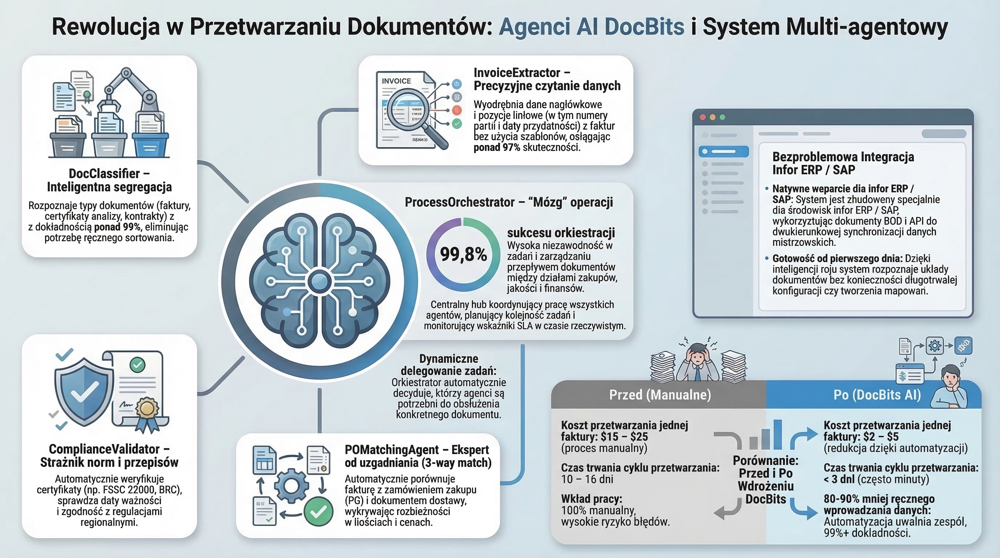

# DocNet – Inteligentne przetwarzanie dokumentów za pomocą agentów AI

<figure><figcaption>
Wieloagentowy system DocBits do autonomicznego przetwarzania dokumentów
</figcaption></figure>

## Czym jest DocNet?

DocNet to platforma automatyzacji zasilana sztuczną inteligencją w ekosystemie DocBits. Umożliwia użytkownikom kontrolowanie przetwarzania dokumentów za pomocą języka naturalnego i automatyzację za pośrednictwem inteligentnych agentów — bez konieczności posiadania wiedzy technicznej.

## Główne korzyści

### 1. Kontrola dokumentów w języku naturalnym

Użytkownicy zadają pytania w codziennym języku i otrzymują natychmiastowe odpowiedzi:

- *"Ile faktur czeka na zatwierdzenie?"*
- *"Jaki jest status faktury 1001?"*
- *"Pokaż mi wszystkie otwarte zamówienia."*
- *"Prześlij moje dokumenty."*

**Korzyść:** Brak nawigacji przez złożone menu. Jedno okno czatu zastępuje dziesiątki kliknięć.

### 2. Agenty AI automatyzują powtarzające się zadania

DocNet zapewnia wstępnie skonfigurowane agenty systemowe, które są gotowe do natychmiastowego użytku:

| Agent | Co robi | Kiedy się aktywuje |
|-------|---------|-------------------|
| **Przewodnik DocBits** | Odpowiada na pytania dotyczące korzystania z DocBits | Na zapytania o pomoc w czacie |
| **Walidacja faktur** | Automatycznie sprawdza pola faktury pod kątem kompletności | Po przesłaniu lub zmianie statusu |
| **Klasyfikacja dokumentów** | Automatycznie identyfikuje typ dokumentu | Dla nieznanych dokumentów |
| **Asystent dopasowania zamówień** | Pomaga w dopasowaniu zamówień | Na żądania dopasowania |

**Korzyść:** Powtarzające się kontrole i przydzielenia przebiegają automatycznie — pracownicy mogą skupić się na wyjątkach.

### 3. Tworzenie niestandardowych agentów

Organizacje mogą konfigurować własnych agentów:

- **Zdefiniuj wyzwalacze:** Przesłanie dokumentu, zmiana statusu, harmonogram, polecenie czatu lub ręczne
- **Przypisz możliwości:** Ekstrakcja, klasyfikacja, walidacja, wyszukiwanie danych głównych, dopasowanie zamówień, tłumaczenie, streszczanie
- **Używaj szablonów:** Szybki start ze sprawdzonymi szablonami agentów

**Korzyść:** Każda organizacja dostosowuje automatyzację do swoich własnych procesów.

### 4. Dostęp wielokanałowy

DocNet jest dostępny wszędzie:

- **Czat internetowy** bezpośrednio w DocBits
- Integracja ze **Slack**
- Integracja z **Microsoft Teams**
- Integracja z **Discord**
- Przetwarzanie **poczty e-mail**

**Korzyść:** Pracownicy korzystają ze znanych im narzędzi komunikacyjnych.

### 5. Orchestrator wieloagentowy

Orchestrator wieloagentowy koordynuje wielu agentów w przypadku złożonych zadań:

1. Przychodzące żądanie (np. wiadomość e-mail z załączonym dokumentem faktury)
2. Automatyczne planowanie: Jacy agenci są potrzebni?
3. Wykonanie w odpowiedniej kolejności
4. Podsumowanie wyniku i powiadomienie

**Korzyść:** Złożone przepływy pracy, które wcześniej wymagały ręcznej koordynacji, działają w pełni automatycznie.

### 6. Integracja MCP dla zewnętrznych narzędzi AI

DocNet obsługuje Model Context Protocol (MCP), umożliwiając zewnętrznym asystentom AI (takim jak Claude Desktop lub inne narzędzia) pracę bezpośrednio z DocBits:

- Przesyłanie i przetwarzanie dokumentów
- Zapytania o status i oczekiwanie na ukończenie
- Ekstrakcja i aktualizacja pól
- Walidacja i eksport dokumentów (np. do Infor ERP / SAP)

**Korzyść:** Asystenci AI stają się pełnoprawnymi użytkownikami DocBits — idealnie do zaawansowanych użytkowników i deweloperów.

## Typowe przypadki użycia

### Przetwarzanie faktur
1. Faktura otrzymana pocztą e-mail
2. Klasyfikacja dokumentów identyfikuje: *Faktura*
3. Ekstrakcja odczytuje pola (numer faktury, kwota, dostawca)
4. Walidacja sprawdza kompletność
5. Dopasowanie zamówień przypisuje fakturę do zamówienia
6. Po pomyślnym zakończeniu: automatyczny eksport do Infor ERP / SAP

### Zapytania dostawców przez czat
- Pracownik pyta: *"Które faktury od dostawcy XY są otwarte?"*
- DocNet przeszukuje bazę danych i dostarcza strukturalną odpowiedź
- Pracownik może wyzwolić działania bezpośrednio: *"Zatwierdź fakturę 1001."*

### Automatyczna kontrola jakości
- Agent sprawdza każdą przesłaną fakturę pod kątem wymaganych pól
- Przy brakujących danych: automatyczne powiadomienie do odpowiedzialnego pracownika
- Pulpit nawigacyjny pokazuje przegląd wszystkich otwartych błędów walidacji

## Porównanie przed i po

| Obszar | Bez DocNet | Z DocNet |
|--------|-----------|---------|
| Status dokumentu | Ręczne sprawdzenie w systemie | Zapytaj przez czat |
| Weryfikacja faktury | Sprawdź każdą fakturę indywidualnie | Automatyczna walidacja |
| Typ dokumentu | Przypisz ręcznie | Automatyczna klasyfikacja |
| Dopasowanie zamówień | Ręczne uzgadnianie | Dopasowanie napędzane AI |
| Komunikacja | Tylko interfejs sieciowy | Czat, Slack, Teams, E-mail |
| Złożone przepływy pracy | Ręczna koordynacja | Orchestrator automatyzuje |
| Narzędzia zewnętrzne | Niemożliwe | Integracja MCP |
