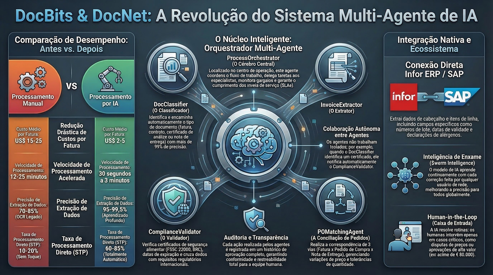

# DocNet – Processamento Inteligente de Documentos com Agentes de IA

<figure><figcaption>
Sistema Multi-Agentes DocBits para Processamento Autônomo de Documentos
</figcaption></figure>

## O que é DocNet?

DocNet é a plataforma de automação orientada por IA dentro do ecossistema DocBits. Ela permite que os usuários controlem o processamento de seus documentos através da linguagem natural e o automatizem com agentes inteligentes — sem necessidade de conhecimento técnico.

## Benefícios Principais

### 1. Controle de Documentos em Linguagem Natural

Os usuários fazem perguntas em linguagem cotidiana e obtêm respostas instantâneas:

- *"Quantas faturas estão aguardando aprovação?"*
- *"Qual é o status da fatura 1001?"*
- *"Mostre-me todas as ordens de compra abertas."*
- *"Enviar meus documentos."*

**Benefício:** Sem necessidade de navegar por menus complexos. Uma única janela de chat substitui dezenas de cliques.

### 2. Agentes de IA Automatizam Tarefas Rotineiras

DocNet fornece agentes de sistema pré-configurados que estão prontos para usar imediatamente:

| Agente | O que faz | Quando é ativado |
|--------|-----------|------------------|
| **Guia DocBits** | Responde perguntas sobre como usar DocBits | Em solicitações de ajuda no chat |
| **Validação de Faturas** | Verifica automaticamente os campos da fatura quanto à integridade | No upload ou mudança de status |
| **Classificação de Documentos** | Identifica automaticamente o tipo de documento | Para documentos desconhecidos |
| **Assistente de Correspondência de PO** | Assiste na correspondência de ordens de compra | Em solicitações de correspondência |

**Benefício:** Verificações recorrentes e atribuições são executadas automaticamente — os funcionários podem se concentrar nas exceções.

### 3. Criar Agentes Personalizados

As organizações podem configurar seus próprios agentes:

- **Definir acionadores:** Upload de documento, mudança de status, agendamento, comando de chat ou manual
- **Atribuir funcionalidades:** Extração, classificação, validação, busca de dados mestres, correspondência de PO, tradução, resumo
- **Usar templates:** Iniciar rapidamente com templates de agentes comprovados

**Benefício:** Cada organização personaliza a automação para seus próprios processos.

### 4. Acesso Multi-Canal

DocNet está acessível em todos os lugares:

- **Chat Web** diretamente em DocBits
- **Slack** integração
- **Microsoft Teams** integração
- **Discord** integração
- **Email** processamento

**Benefício:** Os funcionários usam suas ferramentas de comunicação familiares.

### 5. Orquestrador Multi-Agentes

O Orquestrador Multi-Agentes coordena vários agentes para tarefas complexas:

1. Solicitação recebida (ex: email com anexo de fatura)
2. Planejamento automático: Quais agentes são necessários?
3. Execução na ordem correta
4. Resumo do resultado e notificação

**Benefício:** Fluxos de trabalho complexos que anteriormente exigiam coordenação manual são executados completamente de forma automática.

### 6. Integração MCP para Ferramentas de IA Externas

DocNet suporta o Model Context Protocol (MCP), permitindo que assistentes de IA externas (como Claude Desktop ou outras ferramentas) trabalhem diretamente com DocBits:

- Enviar e processar documentos
- Consultar status e aguardar conclusão
- Extrair e atualizar campos
- Validar e exportar documentos (por exemplo, para Infor ERP / SAP)

**Benefício:** Assistentes de IA se tornam usuários completos de DocBits — ideal para usuários avançados e desenvolvedores.

## Casos de Uso Típicos

### Processamento de Faturas
1. Fatura recebida por email
2. Classificação de documento identifica: *Fatura*
3. Extração lê campos (número da fatura, valor, fornecedor)
4. Validação verifica integridade
5. Correspondência de PO atribui a fatura à ordem de compra
6. Em caso de sucesso: exportação automática para Infor ERP / SAP

### Consultas de Fornecedores via Chat
- Funcionário pergunta: *"Quais faturas do fornecedor XY estão em aberto?"*
- DocNet pesquisa o banco de dados e fornece uma resposta estruturada
- O funcionário pode disparar ações diretamente: *"Aprovar fatura 1001."*

### Controle de Qualidade Automático
- Agente verifica cada fatura enviada quanto aos campos obrigatórios
- Em caso de dados ausentes: notificação automática ao funcionário responsável
- Dashboard mostra visão geral de todos os erros de validação abertos

## Comparação Antes e Depois

| Área | Sem DocNet | Com DocNet |
|------|-----------|-----------|
| Status do documento | Verificar manualmente no sistema | Perguntar via chat |
| Verificação de fatura | Verificar cada fatura individualmente | Validação automática |
| Tipo de documento | Atribuir manualmente | Classificação automática |
| Correspondência de PO | Reconciliação manual | Correspondência alimentada por IA |
| Comunicação | Apenas Web UI | Chat, Slack, Teams, Email |
| Fluxos de trabalho complexos | Coordenação manual | Orquestrador automatiza |
| Ferramentas externas | Não é possível | Integração MCP |
