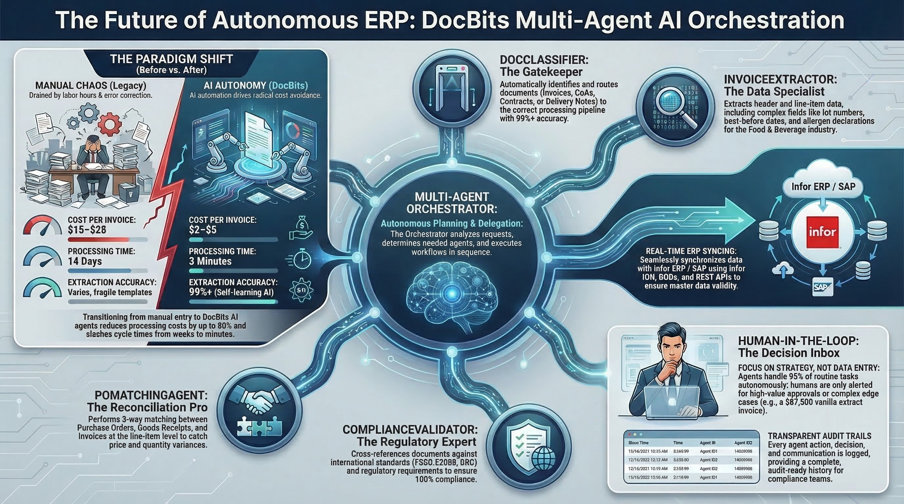

# DocNet – Intelligent Document Processing with AI Agents

<figure><figcaption>
DocBits Multi-Agent System for Autonomous Document Processing
</figcaption></figure>

## What is DocNet?

DocNet is the AI-powered automation platform within the DocBits ecosystem. It enables users to control their document processing through natural language and automate it with intelligent agents — no technical expertise required.

## Core Benefits

### 1. Natural Language Document Control

Users ask questions in everyday language and get instant answers:

- *"How many invoices are waiting for approval?"*
- *"What is the status of invoice 1001?"*
- *"Show me all open purchase orders."*
- *"Upload my documents."*

**Benefit:** No navigating through complex menus. A single chat window replaces dozens of clicks.

### 2. AI Agents Automate Routine Tasks

DocNet provides pre-configured system agents that are ready to use immediately:

| Agent | What it does | When it activates |
|-------|-------------|-------------------|
| **DocBits Guide** | Answers questions about using DocBits | On help requests in chat |
| **Invoice Validation** | Automatically checks invoice fields for completeness | On upload or status change |
| **Document Classification** | Automatically identifies document type | For unknown documents |
| **PO Match Assistant** | Assists with purchase order matching | On matching requests |

**Benefit:** Recurring checks and assignments run automatically — employees can focus on exceptions.

### 3. Create Custom Agents

Organizations can configure their own agents:

- **Define triggers:** Document upload, status change, schedule, chat command, or manual
- **Assign capabilities:** Extraction, classification, validation, master data lookup, PO matching, translation, summarization
- **Use templates:** Quick start with proven agent templates

**Benefit:** Every organization tailors automation to its own processes.

### 4. Multi-Channel Access

DocNet is accessible everywhere:

- **Web Chat** directly in DocBits
- **Slack** integration
- **Microsoft Teams** integration
- **Discord** integration
- **Email** processing

**Benefit:** Employees use their familiar communication tools.

### 5. Multi-Agent Orchestrator

The Multi-Agent Orchestrator coordinates multiple agents for complex tasks:

1. Incoming request (e.g., email with invoice attachment)
2. Automatic planning: Which agents are needed?
3. Execution in the correct order
4. Result summary and notification

**Benefit:** Complex workflows that previously required manual coordination run fully automatically.

### 6. MCP Integration for External AI Tools

DocNet supports the Model Context Protocol (MCP), allowing external AI assistants (such as Claude Desktop or other tools) to work directly with DocBits:

- Upload and process documents
- Query status and wait for completion
- Extract and update fields
- Validate and export documents (e.g., to Infor ERP / SAP)

**Benefit:** AI assistants become full DocBits users — ideal for power users and developers.

## Typical Use Cases

### Invoice Processing
1. Invoice received via email
2. Document classification identifies: *Invoice*
3. Extraction reads fields (invoice number, amount, supplier)
4. Validation checks completeness
5. PO matching assigns the invoice to the purchase order
6. On success: automatic export to Infor ERP / SAP

### Supplier Inquiries via Chat
- Employee asks: *"Which invoices from supplier XY are open?"*
- DocNet searches the database and delivers a structured answer
- Employee can trigger actions directly: *"Approve invoice 1001."*

### Automatic Quality Control
- Agent checks every uploaded invoice for required fields
- On missing data: automatic notification to the responsible employee
- Dashboard shows overview of all open validation errors

## Before & After Comparison

| Area | Without DocNet | With DocNet |
|------|---------------|-------------|
| Document status | Manually check in the system | Ask via chat |
| Invoice verification | Check each invoice individually | Automatic validation |
| Document type | Assign manually | Automatic classification |
| PO matching | Manual reconciliation | AI-powered matching |
| Communication | Web UI only | Chat, Slack, Teams, Email |
| Complex workflows | Manual coordination | Orchestrator automates |
| External tools | Not possible | MCP integration |
